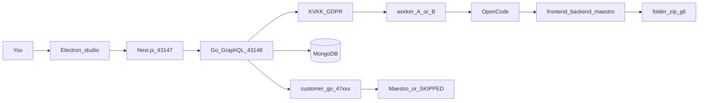

# Cherry

Cherry is a **desktop studio** for Windows and macOS. It is **not** a mobile app.

You describe a product in chat. A background agent writes a mobile app — frontend, backend, and Maestro flows — boots the backend on localhost, and runs UI tests. You hand the customer **files** (folder, zip, or git). Cherry does **not** host that app.

The generated stack is yours to choose: **Expo** (TypeScript), **Flutter** (Dart), or **SwiftUI**. The zip is that stack’s language and Clean Architecture. Studio `preview/` HTML is never the handoff.

<p align="center">
  
</p>

## What it is / what it is not

| Cherry is | Cherry is not |
| --- | --- |
| Electron on Windows and macOS | A phone client, an Expo app, or a public website |
| A platform API: Go GraphQL + MongoDB | The same process as the generated customer backend |
| Delivery as folder / zip / git | A host for customer APIs (no public URL in v1) |
| OpenCode as the writer, Maestro for UI tests | A reimplementation of OpenCode |
| Workers A and B as **capacity** (same job type) | “A codes, B tests” |

Two backends stay apart:

1. **Platform** — Cherry’s Go GraphQL API (`127.0.0.1:43148`) and MongoDB (sessions, projects metadata, LLM versions, audit).
2. **Customer** — files on disk under `frontend/`, `backend/`, `maestro/`. For tests only, Cherry starts `go run backend/main.go` on `127.0.0.1:47000–47999`. That process is a child, not the platform listener.

## How it works



1. Sign in (password, 6-digit new-device code, optional TOTP). One active session. No SMS.
2. Create a project: name, brief, stack, backend target (local / Connections).
3. Chat. Every LLM call is **redact → worker A or B → output scan → audit**. The UI never calls a model.
4. OpenCode writes into the project directory (`opencode run --dir <absolute-root> --auto`). If the CLI is missing, the scaffold stays; Cherry does not fake writes.
5. **Activate** starts the generated backend on a high localhost port. **Maestro** runs against a real device or emulator. No device → **SKIPPED**, never a fake PASSED.
6. Export zip/git. Connections (OAuth) bind *your* GitHub / Supabase / Cloudflare / Render / Vercel accounts. Cherry is not the host.

## Repository

npm workspaces at the root (one lockfile, one `node_modules`). The API is a separate Go module.

```
package.json            workspaces: apps/*
apps/web                Next.js renderer (cherry-web)
apps/desktop            Electron main + preload (cherry-desktop)
services/api            Go GraphQL (gqlgen)
docs/                   architecture, security, LLMOps, screens
colab/                  worker A/B notebooks + seed pack
vendor/bin              OpenCode + Maestro (gitignored; install script)
.cursor/rules           per-section invariants
```

Install from the **repo root only**. Never `npm install` inside `apps/*`.

Low-level map (ports, GraphQL operations, Mongo indexes, packages): [docs/low-level-architecture.md](docs/low-level-architecture.md).

## Requirements

- Node.js 22+
- Go 1.22+
- Optional: MongoDB (`MONGO_URI`) or Docker Compose for `mongo`
- Optional: Java 17+ and an Android emulator / iOS Simulator for Maestro
- Optional: `cloudflared` for the Colab pack/checkpoint tunnel

## Run locally

```bash
cp .env.example .env          # optional; see comments in the file
npm install                   # once, at the repo root
npm run dev:api               # GraphQL + /health on 127.0.0.1:43148
npm run dev:web               # UI on http://127.0.0.1:43147
npm run dev:desktop           # Electron shell (talks to the dev UI)
```

`dev:api` loads `.env` and tries native `mongod` via `scripts/ensure-mongo.sh` when `MONGO_URI` is set. Prefer Docker with `docker compose up -d mongo`. If Mongo is down, the API falls back to an in-memory store (lost on restart).

| Process | Address | Role |
| --- | --- | --- |
| Next.js renderer | `127.0.0.1:43147` | Screens |
| Platform API | `127.0.0.1:43148` | GraphQL, `/health`, zip export, OAuth, Colab files |
| Colab bridge | `127.0.0.1:43149` | Pack/checkpoint only — do not tunnel GraphQL |
| Generated backend | `127.0.0.1:47000–47999` | Local test child process |

Open http://127.0.0.1:43147 → **Create account** (password ≥ 8). Without SMTP or Resend, the 6-digit code lands in the **in-app mailbox** (`emailSent: false`). With mail configured, the code is not shown on the card.

Add a JS dependency: `npm i <pkg> -w cherry-web`.

## Sidecars (OpenCode and Maestro)

The person using Cherry does not install OpenCode or Maestro. Developers (and the Windows/macOS installer) fill `vendor/bin`:

```bash
./scripts/vendor-sidecars.sh
```

Lookup order: `CHERRY_OPENCODE_BIN` / `CHERRY_MAESTRO_BIN` → `CHERRY_SIDECAR_DIR` → `vendor/bin` → `PATH`. Binaries are gitignored.

## LLM workers, GDPR, Colab

Workers **A** and **B** do the same kind of job. They exist so several people can share load (on the order of ten concurrent users), not to split “codegen vs test”. The router takes an idle slot; if both are busy, jobs queue. `setActiveVersion` changes **later** completions; in-flight jobs keep the old pointer.

Every call: PII redact → model → output scan → `auditEvent`. Email, phone, national id, auth codes, TOTP, session tokens, and customer `.env` secrets are stripped. `exportMe` / `deleteMe` are first-class. `trainingPack` is a redacted SFT pack for Colab, not a full data export.

- No `CHERRY_LLM_API_KEY` → mock completer (still wrapped).
- Key present → HTTP completer + OpenCode `OPENAI_API_KEY`.
- `setColabInferenceUrl(slot, url)` → that slot uses a Colab `/v1` tunnel. Health is `GET {url}/models` (URL must include `/v1`).

Colab notebooks in [`colab/`](colab/) are **files**, not Cherry’s production inference. Two T4-class sessions if you train A and B in parallel. Do not put Cherry API keys, Mongo, SMTP, or session tokens in Colab.

## Security

X-inspired, first-party mail (no AgentMail, no SMS, no phone identity):

- Password (argon2id or bcrypt)
- 6-digit challenge on a new device, hashed, ~10 minute TTL
- Email `verifyLink`
- TOTP
- Trusted devices, session list, revoke
- One active session per account

Electron: `nodeIntegration: false`, `contextIsolation: true`. Device fingerprint stays in main.

Contract: [`services/api/graph/schema.graphqls`](services/api/graph/schema.graphqls) (GraphQL, not Swagger).

## Desktop package (Windows / macOS)

The customer should not install Next, Go, or OpenCode. On a Windows or Mac machine:

```bash
./scripts/vendor-sidecars.sh
npm run dist:desktop
```

This bundles `cherry-api`, the Next.js standalone server, sidecars, and `colab/` into `apps/desktop/release-out/`. The packaged app spawns API + UI on 43148 / 43147. Linux CI only smoke-tests an unpacked directory — product targets are NSIS/zip (Windows) and dmg/zip (macOS).

## Status

Slices **1–8** are in the repo (shell, auth, project disk, LLM A + GDPR, OpenCode, local activate + Maestro, LLM B + queue, Colab files).

Still open:

- Organization UI (personal `workspaceKind` exists; org sidebar is off)
- Signed installers must be built on Windows/macOS
- No public hosted web app
- Colab is not a standing production worker; the emulator lives on your machine

Details: [docs/remaining.md](docs/remaining.md) · project dossier: [docs/cherry-proje-dosyasi.pdf](docs/cherry-proje-dosyasi.pdf)

## Documentation

Start at [docs/README.md](docs/README.md) (rules + diagrams per section). Agents: [AGENTS.md](AGENTS.md).

| Topic | Doc |
| --- | --- |
| Architecture | [docs/architecture.md](docs/architecture.md) · [docs/low-level-architecture.md](docs/low-level-architecture.md) |
| GraphQL / Mongo | [docs/backend-graphql.md](docs/backend-graphql.md) · [docs/database.md](docs/database.md) |
| Security / mail | [docs/security.md](docs/security.md) · [docs/email-verification.md](docs/email-verification.md) |
| Factory / OpenCode | [docs/mobile-factory.md](docs/mobile-factory.md) · [docs/opencode.md](docs/opencode.md) |
| Local activate / Maestro | [docs/local-activate.md](docs/local-activate.md) · [docs/maestro.md](docs/maestro.md) |
| LLMOps / Colab / GDPR | [docs/llmops.md](docs/llmops.md) · [docs/colab.md](docs/colab.md) · [docs/gdpr-kvkk.md](docs/gdpr-kvkk.md) |
| Desktop / Connections | [docs/desktop.md](docs/desktop.md) · [docs/connections.md](docs/connections.md) |
| UI | [docs/design-system.md](docs/design-system.md) · [docs/screens.md](docs/screens.md) |
