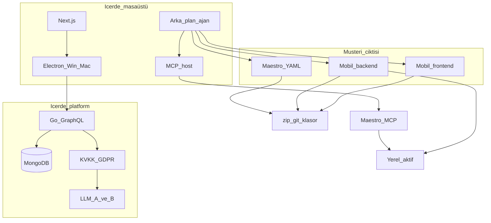

# İçerde belgeler / Documents

Her bölümün **kuralı** (`.cursor/rules`) ve **çizimli belgesi** (`docs/`) vardır.

Each section has a **rule** and a **document with diagrams**.

## Okuma sırası / Read order

1. [build-order.md](build-order.md) — ne önce
1b. [remaining.md](remaining.md) — duraklama: bitti / kalan
2. [architecture.md](architecture.md) — sistem resmi
2. [security.md](security.md) + [email-verification.md](email-verification.md)
3. [organizations.md](organizations.md) — kişisel / org
4. [backend-graphql.md](backend-graphql.md) + [database.md](database.md)
5. [design-system.md](design-system.md) + [motion.md](motion.md) + [screens.md](screens.md)
6. [frontend.md](frontend.md) + [desktop.md](desktop.md)
7. [mobile-factory.md](mobile-factory.md) + [local-activate.md](local-activate.md) + [maestro.md](maestro.md)
8. [llmops.md](llmops.md) + [gdpr-kvkk.md](gdpr-kvkk.md)
9. [integrations.md](integrations.md) — MCP / CLI

## Bölüm tablosu / Section table

| # | Bölüm | Rule | Doc |
| --- | --- | --- | --- |
| 00 | Proje | [00-project.mdc](../.cursor/rules/00-project.mdc) | this file |
| 01 | Mimari | [01-architecture.mdc](../.cursor/rules/01-architecture.mdc) | [architecture.md](architecture.md) |
| 02 | GraphQL Go | [02-backend-graphql.mdc](../.cursor/rules/02-backend-graphql.mdc) | [backend-graphql.md](backend-graphql.md) |
| 03 | MongoDB | [03-database.mdc](../.cursor/rules/03-database.mdc) | [database.md](database.md) |
| 04 | Next.js | [04-frontend.mdc](../.cursor/rules/04-frontend.mdc) | [frontend.md](frontend.md) |
| 05 | Electron | [05-desktop.mdc](../.cursor/rules/05-desktop.mdc) | [desktop.md](desktop.md) |
| 06 | Güvenlik | [06-security.mdc](../.cursor/rules/06-security.mdc) | [security.md](security.md) |
| 07 | Org | [07-organizations.mdc](../.cursor/rules/07-organizations.mdc) | [organizations.md](organizations.md) |
| 08 | Mobil fabrika | [08-mobile-factory.mdc](../.cursor/rules/08-mobile-factory.mdc) | [mobile-factory.md](mobile-factory.md) |
| 09 | Yerel aktif | [09-local-activate.mdc](../.cursor/rules/09-local-activate.mdc) | [local-activate.md](local-activate.md) |
| 10 | Maestro | [10-maestro.mdc](../.cursor/rules/10-maestro.mdc) | [maestro.md](maestro.md) |
| 11 | LLMOps | [11-llmops.mdc](../.cursor/rules/11-llmops.mdc) | [llmops.md](llmops.md) |
| 12 | KVKK/GDPR | [12-gdpr-kvkk.mdc](../.cursor/rules/12-gdpr-kvkk.mdc) | [gdpr-kvkk.md](gdpr-kvkk.md) |
| 13 | TypeScript | [13-typescript.mdc](../.cursor/rules/13-typescript.mdc) | [frontend.md](frontend.md) |
| 14 | Go | [14-go.mdc](../.cursor/rules/14-go.mdc) | [backend-graphql.md](backend-graphql.md) |
| 15 | Tasarım | [15-design.mdc](../.cursor/rules/15-design.mdc) | [design-system.md](design-system.md) · [screens.md](screens.md) |
| 16 | Hareket | [16-motion.mdc](../.cursor/rules/16-motion.mdc) | [motion.md](motion.md) |
| 17 | MCP / CLI | [17-integrations.mdc](../.cursor/rules/17-integrations.mdc) | [integrations.md](integrations.md) |
| 18 | E-posta / 6 hane | [18-email-verification.mdc](../.cursor/rules/18-email-verification.mdc) | [email-verification.md](email-verification.md) |
| 19 | Yapım sırası | [19-build-order.mdc](../.cursor/rules/19-build-order.mdc) | [build-order.md](build-order.md) |
