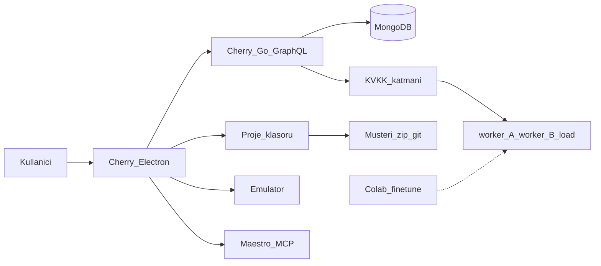
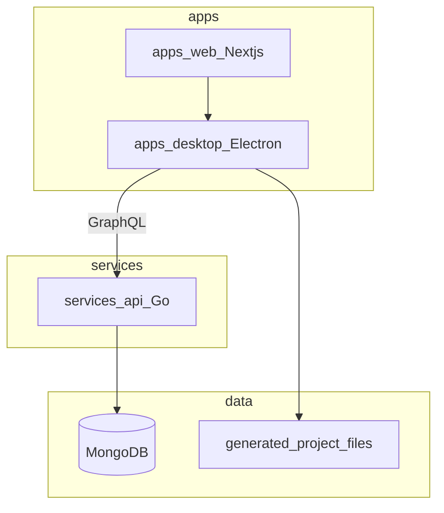

# Mimari / Architecture

**Kural:** [.cursor/rules/01-architecture.mdc](../.cursor/rules/01-architecture.mdc)

**TR:** Cherry, kullanıcının bilgisayarında duran bir stüdyo + kendi GraphQL platformudur. Üretilen mobil uygulama ayrı bir çıktıdır.

**EN:** Cherry is a studio on the user’s computer plus its own GraphQL platform. The generated mobile app is a separate artifact.

## Sistem bağlamı / System context

## Konteynerler / Containers

## Sabitler / Invariants

- Tek GraphQL sözleşmesi: platform. Üretilen müşteri API’si bu şemada yaşamaz.
- UI asla LLM’e doğrudan gitmez.
- LLM A ve B aynı iş türlerini yapar; ikinci yuva eşzamanlı yoğunluk içindir.
- v1’de Cherry müşteri backend’i için public URL vermez. Kişi ileride kendi Supabase/Cloudflare/Vercel/Render hesabını Bağlantılar’dan bağlar; o URL onundur.

| Parça | Sorumluluk |
| --- | --- |
| `apps/web` | Ekranlar: giriş, projeler, ajan, LLM admin, güvenlik |
| `apps/desktop` | Pencere, tepsi, runner, MCP, yerel aktif |
| `services/api` | Auth, org, işler, LLM router, GDPR, denetim |
| Disk | Müşteri FE/BE/Maestro dosyaları |
