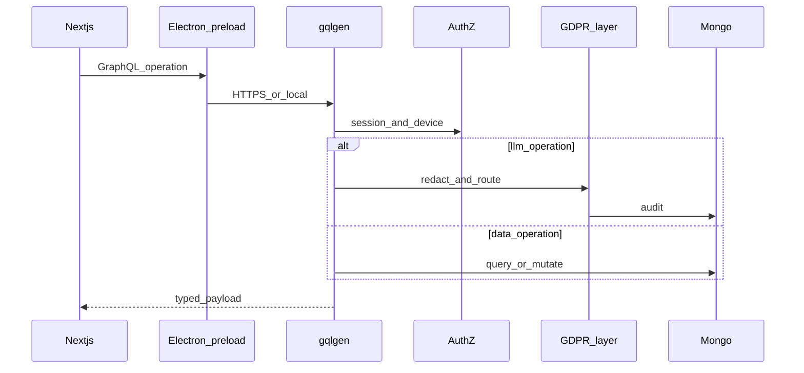
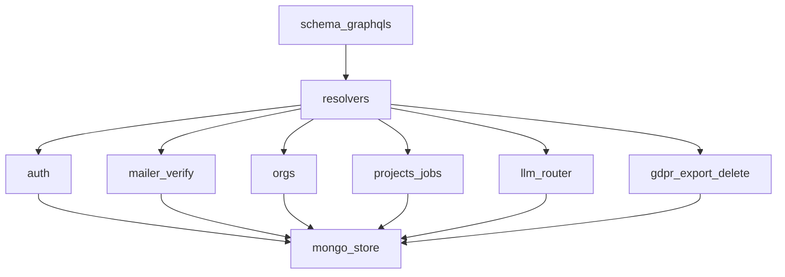

# GraphQL Go — platform API

**Kural:** [.cursor/rules/02-backend-graphql.mdc](../.cursor/rules/02-backend-graphql.mdc) · [14-go.mdc](../.cursor/rules/14-go.mdc)

**TR:** Bu, İçerde’nin kendi backend’idir. Müşteriye verilen mobil uygulamanın API’si değildir.

**EN:** This is Icerde’s own backend. It is not the API of the generated mobile app.

## İstek yolu / Request path

## Modül sınırları / Module bounds

## İlk şema grupları / First schema groups

- `Auth`: register, login, verifyCode, totp, devices, sessions, logout, mailbox (first-party; no AgentMail)
- `Workspace`: personal profile, organizations, members
- `Factory`: projects, jobs, artifacts path metadata (not file blobs in Mongo)
- `LLMOps`: versions, active pointer, switch, mcpRoot, trainingPack, registerLlmVersion
- `Privacy`: exportMe, deleteMe, audit (admin)

Health: `GET /health`. GraphQL otherwise, plus `/export/:id` (zip), `/colab/*` (notebook + seed files), `/oauth/*`.
