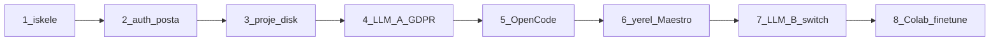

# Yapım sırası / Build order

**Karar:** Önce **programın çalışan kabuğu**, sonra **tek LLM yuvası**. İki modeli, Colab’i ve fine-tune’u en başa alma.

**Decision:** Build the **running app shell** first, then **one LLM slot**. Do not start with two models, Colab, or fine-tune.

## Neden program önce / Why the program first

Yapay zekanın duracağı yer yoksa model seçmek boşa gider: iş kuyruğu, dosya kökü, GDPR sarmalayıcı, yönetici switch’i, Maestro hedefi hep uygulamada.

The model has nowhere to live without jobs, a file root, the GDPR wrapper, the admin switch, and a Maestro target.

Fine-tune için gerçek brif + üretilen kod + test log’u gerekir. Onlar kabuk yokken yok.

## Neden “tüm AI” değil / Why not “finish AI first”

- İki LLM + versiyon + Colab, ürün döngüsü olmadan spekülatif.
- İlk yuva **LLM A (kod)** yeter: sarmalayıcı + bir tamamlayıcı. Cevap değişimini kanıtlamak için ikinci yuva **sonra**.

## Dilimler / Slices

1. **İskele** — Electron + Next.js (tasarım token’ları) + Go GraphQL + Mongo. Ekran: giriş iskeleti, projeler boş hali.
2. **Auth + posta** — şifre, 6 hane, bizim mailer, cihaz, tek oturum, TOTP. SMS yok.
3. **Proje diski** — brif, yığın seçimi, `frontend/` `backend/` `maestro/` klasörü, zip. Ajan henüz sahte/stub dosya yazabilir.
4. **LLM A + GDPR** — tek model, redact → tamamla → denetim. MCP read-file kökü proje klasörü. Admin’de tek aktif versiyon.
5. **OpenCode** — stub yazıcı yerine gerçek kod motoru.
6. **Yerel aktif + Maestro** — backend localhost, `maestro mcp`, skip-if-no-device.
7. **LLM B + tek tuş switch** — test yuvası; switch sonraki cevapları değiştirir.
8. **Colab fine-tune** — izler birikince.

Şimdi yapılacak bir sonraki iş: **3 — proje diski**. Dilim 2 auth kodda.

**Duraklama (2026-09-02):** uygulama durdu. Kalan iş listesi: [remaining.md](remaining.md). Kod yazmaya dönünce oradan devam.

