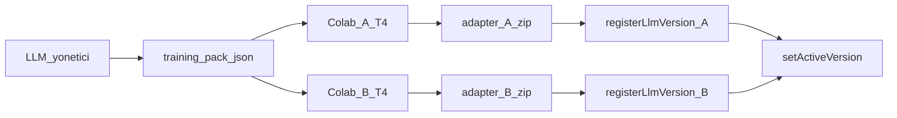

# Colab fine-tune — dosyalar ve sıra / files and order

**Kural:** [.cursor/rules/11-llmops.mdc](../.cursor/rules/11-llmops.mdc) · [llmops.md](llmops.md)

**TR:** Colab’de eğitim **senin Google hesabında** olur. Cherry Colab barındırmaz ve Colab MCP değildir. Bu repodaki dosyaları Colab’e yüklersin; adapter zip’ini indirir, stüdyoda yeni `llmVersion` kaydedersin.

**EN:** Training runs on **your** Colab runtime. Cherry does not host Colab. Upload these files, download the adapter zip, register a new immutable version in the studio.

## Dosyalar / Files

Repo kökü `colab/`:

| Dosya | İş |
| --- | --- |
| `colab/cherry_worker_a.ipynb` | İşçi A, 16GB T4, QLoRA |
| `colab/cherry_worker_b.ipynb` | İşçi B, **aynı tarif** |
| `colab/examples/cherry_training_pack.json` | Seed paket (canlı iz yokken) |
| `colab/examples/cherry_sft.jsonl` | Aynı seed, satır satır |
| `colab/training_pack.schema.json` | JSON şema |

Stüdyo **LLM** sayfasından da indirilir: canlı paket (JSON + JSONL), notebook’lar, seed.

## Sıra / Order



1. Cherry’de bir proje üret (brif + kod + Maestro). Yoksa seed paketi kullan.
2. LLM yönetici → **Eğitim paketini indir** (`cherry-training-pack.json` + `.jsonl`).
3. [colab.research.google.com](https://colab.research.google.com) — **iki oturum**. Her birinde Runtime → GPU → **T4**.
4. Oturum A’ya `cherry_worker_a.ipynb` + JSON yükle. Oturum B’ye `cherry_worker_b.ipynb` + **aynı** JSON.
5. Hücreleri sırayla çalıştır. Adapter zip iner.
6. LLM yönetici → **Colab sürümü kaydet** (`slot` A veya B, `checkpointRef` = zip adı). Pointer’ı **sen** çevirirsin. In-flight iş eski pointer’da biter.

## Sabitler / Invariants

| Bu / This | Değil / Not |
| --- | --- |
| QLoRA / LoRA, ~1.5B 4-bit, 16GB / oturum | Tam ağırlık büyük model |
| İki Colab = iki GPU hakkı | Tek T4’te A+B |
| Paket: brif + kaynak + Maestro + redakte tamamlamalar | Ham e-posta, token, `.env`, `preview/` |
| Checkpoint → immutable `llmVersion` | Colab 24/7 üretim API |

## Paket içeriği / Pack contents

`schema`: `cherry.training_pack.v1`

Her örnek: `instruction`, `input`, `output`. Canlı iz inceyse stüdyo **seed** örnek ekler (işaret `source: seed`).

JSONL satırı:

```json
{"instruction":"...","input":"...","output":"..."}
```

## GPU

Colab ücretsiz T4 ≈ 16GB. Notebook 4-bit `Qwen/Qwen2.5-1.5B-Instruct` + LoRA r=16. GPU yoksa hücre durur; CPU’ya düşmez.

## Gizlilik / Privacy

Paket `exportMe` değildir. Yalnızca redakte eğitim satırları. Başka kiracı yok. Colab’e yüklemeden JSON’u açıp `[REDACTED_` ve secret tarayın.
