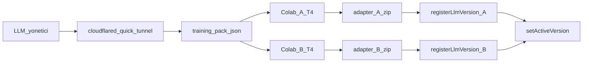
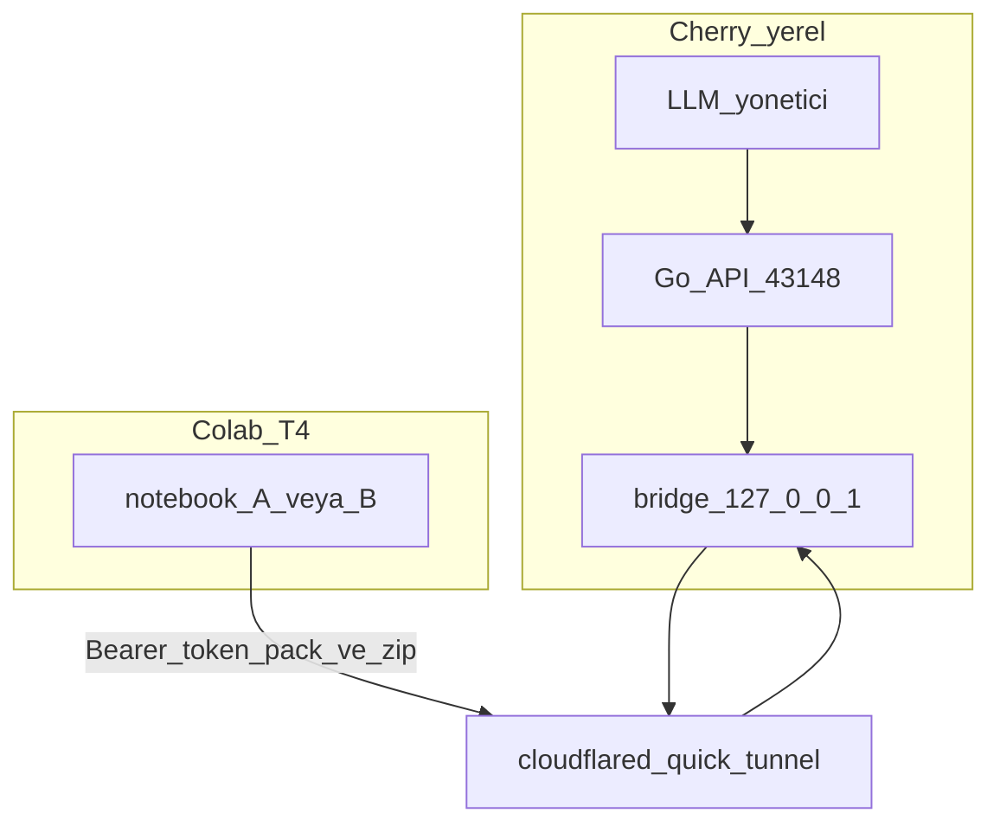

# Colab fine-tune — dosyalar ve sıra / files and order

**Kural:** [.cursor/rules/11-llmops.mdc](../.cursor/rules/11-llmops.mdc) · [llmops.md](llmops.md)

**TR:** Colab’de eğitim **senin Google hesabında** olur. Cherry Colab barındırmaz ve Colab MCP değildir. Bu repodaki dosyaları Colab’e yüklersin; adapter zip’ini indirir, stüdyoda yeni `llmVersion` kaydedersin.

**EN:** Training runs on **your** Colab runtime. Cherry does not host Colab. Upload these files, download the adapter zip, register a new immutable version in the studio.

## Dosyalar / Files

Repo kökü `colab/`:

| Dosya | İş |
| --- | --- |
| `colab/cherry_worker_a.ipynb` | İşçi A, 16GB T4, QLoRA |
| `colab/cherry_worker_b.ipynb` | İşçi B, **aynı tarif** |
| `colab/examples/cherry_training_pack.json` | Seed paket (canlı iz yokken) |
| `colab/examples/cherry_sft.jsonl` | Aynı seed, satır satır |
| `colab/training_pack.schema.json` | JSON şema |

Stüdyo **LLM** sayfasından da indirilir: canlı paket (JSON + JSONL), notebook’lar, seed.

## Sıra / Order



1. Cherry’de bir proje üret (brif + kod + Maestro). Yoksa seed paketi kullan.
2. LLM yönetici → **Colab tünelini aç** (`cloudflared` quick tunnel). URL + köprü token’ı notebook’a yapıştır. `cloudflared` yoksa tünel açılmaz — sahte URL yok; o zaman paketi elle indir.
3. [colab.research.google.com](https://colab.research.google.com) — **iki oturum**. Her birinde Runtime → GPU → **T4**.
4. Oturum A’ya `cherry_worker_a.ipynb` yükle (tünel paketi çeker). Tünel yoksa JSON’u elle yükle. Oturum B’ye `cherry_worker_b.ipynb` + **aynı** paket.
5. Hücreleri sırayla çalıştır. Adapter zip tünelden stüdyoya döner; yoksa makineye iner.
6. Tünel kaydı immutable `llmVersion` üretir. Pointer’ı **sen** çevirirsin. In-flight iş eski pointer’da biter. Elle yol: LLM yönetici → **Colab sürümü kaydet**.

## Cloudflare tüneli / Cloudflare tunnel

**TR:** Colab Google’da çalışır; stüdyo yerelde. El sıkışması `cloudflared tunnel --url` (trycloudflare quick tunnel). Cherry Colab barındırmaz. Bu, **Bağlantılar → Cloudflare Workers** değildir.

**EN:** Colab runs on Google; the studio is local. Handshake is `cloudflared tunnel --url` (trycloudflare quick tunnel). Cherry does not host Colab. This is **not** Connections → Cloudflare Workers.



| Bu / This | Değil / Not |
| --- | --- |
| Yerel köprü + public HTTPS (trycloudflare) | Cherry’de Colab runtime |
| Token’lı `GET /pack.json` + `POST /checkpoint` | Tüm GraphQL’i internete açmak |
| Sidecar `cloudflared` (vendor/bin veya PATH) | Bağlantılar’daki kişi Cloudflare hesabı |
| Colab paket çeker / adapter gönderir | Colab 24/7 üretim inferansı |

Köprü yalnızca `127.0.0.1` üzerinde dinler. Tünel o porta bakar — platform GraphQL, auth ve mailbox public olmaz. Token oturum token’ı değildir; tünel her açılışta yenilenir. GraphQL stüdyo oturumuna tam token’ı gösterir (yapıştırmak için); `tokenHint` son 4.

`cloudflared` yoksa durum `FAILED`, `publicUrl` boş. Sahte “bağlı” yok.

Env: `CHERRY_CLOUDFLARED_BIN`, `CHERRY_COLAB_BRIDGE_ADDR` (varsayılan `127.0.0.1:43149`).

## Sabitler / Invariants

| Bu / This | Değil / Not |
| --- | --- |
| QLoRA / LoRA, ~1.5B 4-bit, 16GB / oturum | Tam ağırlık büyük model |
| İki Colab = iki GPU hakkı | Tek T4’te A+B |
| Paket: brif + kaynak + Maestro + redakte tamamlamalar | Ham e-posta, token, `.env`, `preview/` |
| Checkpoint → immutable `llmVersion` | Colab 24/7 üretim API |
| Cloudflare quick tunnel = Colab el sıkışması | Müşteri Workers / D1 / R2 |

## Paket içeriği / Pack contents

`schema`: `cherry.training_pack.v1`

Her örnek: `instruction`, `input`, `output`. Canlı iz inceyse stüdyo **seed** örnek ekler (işaret `source: seed`).

JSONL satırı:

```json
{"instruction":"...","input":"...","output":"..."}
```

## Geçici inferans / Temporary inference

Fine-tune sonrası model, aynı Colab oturumunda OpenAI uyumlu API olarak sunulabilir. Bu **geçici** bir çözümdür — Colab oturumu kapanınca bağlantı kopar. Üretim için kalıcı endpoint kullan.

### Akış / Flow

```mermaid
flowchart LR
  Train[Fine_tune_bitir] --> Serve[FastAPI_8000]
  Serve --> CF[cloudflared_tunnel]
  CF --> URL[trycloudflare_URL]
  URL --> Studio[Cherry_stüdyo]
  Studio --> Complete[/v1/chat/completions]
```

1. Notebook hücre 8: Model `model.eval()` ile inferans moduna geçer. FastAPI + uvicorn `0.0.0.0:8000`'de dinler.
2. Notebook hücre 9: `cloudflared tunnel --url http://localhost:8000` ile quick tunnel açılır. `https://xxx.trycloudflare.com` URL'si yazdırılır.
3. Notebook hücre 10: Oturumu canlı tutar (60s döngü).
4. Cherry stüdyoda: LLM yönetici → Colab inferans → URL'yi yapıştır. `setColabInferenceUrl` mutation'ı çağrılır.
5. Cherry completer, `colab-tunnel` kanalıyla istekleri tünele yönlendirir. GDPR katmanı hâlâ aktif (redact → complete → scan → audit).
6. Sağlık kontrolü 30 saniyede bir `/v1/models` endpoint'ini yoklar. Yanıt gelmezse durum `DISCONNECTED` olur ve varsayılan completer kullanılır.

### Sabitler / Invariants

| Bu / This | Değil / Not |
| --- | --- |
| Geçici inferans — Colab açıkken | 24/7 üretim API |
| Aynı 16GB T4, aynı QLoRA model | Tam ağırlık büyük model |
| `colab-tunnel` kanal, GDPR aktif | GDPR'sız doğrudan çağrı |
| Kullanıcı URL'yi elle yapıştırır | Otomatik keşif |
| Bağlantı kopunca varsayılan endpoint | Yeniden bağlanma |

## GPU

Colab ücretsiz T4 ≈ 16GB. Notebook 4-bit `Qwen/Qwen2.5-1.5B-Instruct` + LoRA r=16. GPU yoksa hücre durur; CPU’ya düşmez.

## Gizlilik / Privacy

Paket `exportMe` değildir. Yalnızca redakte eğitim satırları. Başka kiracı yok. Colab’e yüklemeden JSON’u açıp `[REDACTED_` ve secret tarayın.
