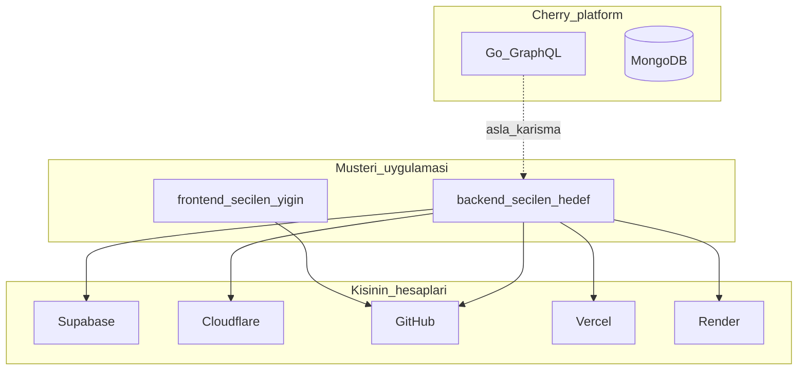
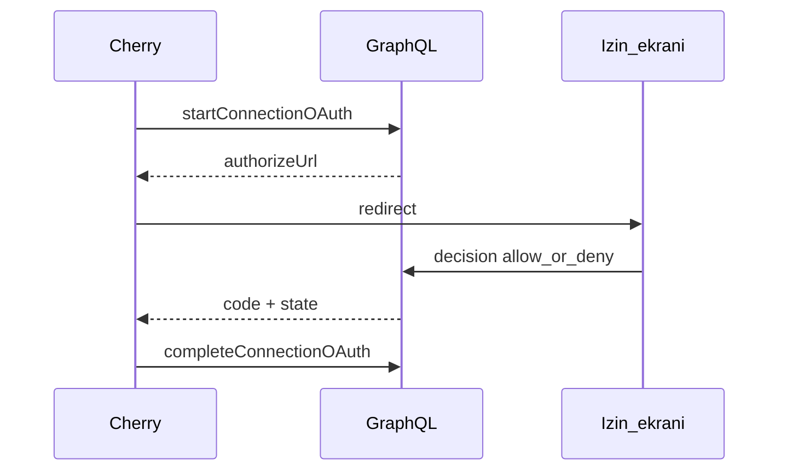

# Bağlantılar / eklentiler — müşteri hesapları

**Kural:** [.cursor/rules/20-connections.mdc](../.cursor/rules/20-connections.mdc)

**TR:** Kişi, ürettiği uygulamanın backend’inin **nerede** duracağını seçer. Cherry barındırmaz. Hesaplar **Bağlantılar** menüsünden, **OAuth 2.0** izin ekranı ile bağlanır.

**EN:** The person chooses **where** the generated app’s backend lives. Cherry does not host it. Accounts under **Connections** are bound with **OAuth 2.0** consent.

## Sistemin adı / What this is called

Kullanıcının tarif ettiği akış:

1. Uygulamada **Bağlan** (Connect with GitHub / Supabase / …)
2. Tarayıcı **sağlayıcının sitesine** (veya onun izin ekranına) gider
3. “**Cherry hesabına erişmek istiyor**” — yetkilendir / iptal
4. Geri dönüş (callback) ile bağlantı kurulur

Bunun adı **OAuth 2.0**, özel olarak **Authorization Code** akışı. Ekran **consent / izin / onay ekranı**.

GitHub OAuth uygulaması (`CHERRY_GITHUB_CLIENT_ID`) varsa gerçek `github.com/login/oauth/authorize` açılır. Yoksa Cherry **yerel izin ekranı** gösterir — aynı onay; sessiz “bağlandı” yok. İptal = bağlı değil.

Token yapıştırma gelişmiş yedek yoldur (Cloudflare API token, PAT, …).

## İki backend kuralı durur / Two-backend rule still holds

- Cherry API’si (Go GraphQL + Mongo) müşteri backend’i **değildir**.
- Müşteri backend’i dosyadır; hedef **yerel Go iskeleti**, **Supabase**, **Cloudflare** veya benzeri olabilir — kişi seçer.
- Cherry bu servislerde uygulama **barındırmaz**. Token ve proje kişinin hesabındadır.
- OpenCode, bağlı hedefe göre `backend/` (ve gerekirse frontend env) yazar.

## Menü / Menu

Sidebar: **Bağlantılar**. Kartlarda sağlayıcı logosu. Birincil düğme OAuth’u başlatır.

## Backend hedefleri / Backend targets

| Hedef | Ne işe yarar |
| --- | --- |
| **Yerel** (varsayılan v1) | `backend/` + localhost 47000–47999. Maestro burayı dener. |
| **Supabase** | Kişinin projesi: Auth, Postgres, Storage. Ajan müşteri API’sini buna yazar. |
| **Cloudflare** | Workers / D1 / R2 — kişi hesabı. |
| Benzeri (eklenti) | Aynı sözleşme: bağla → seç → ajan o hedefe yazar. Sahte “bağlandı” yok. |

Bağlı değilse hedef seçilemez; ajan uydurma URL yazmaz.

## Teslim / git / deploy

| Bağlantı | Ne |
| --- | --- |
| **GitHub** | Geliştirilen proje kişinin reposuna **çekilir / push**. Teslim zip’e ek, yerine geçmez. |
| **Vercel** | Kişi hesabına frontend (veya seçilen parça) deploy — Cherry host değil. |
| **Render** | Kişi hesabına backend/servis deploy — Cherry host değil. |

GitHub push: gerçek `git push`. Yerel OAuth grant’i (client id yokken) GitHub’a push **etmez** — hata görünür. `CHERRY_GITHUB_CLIENT_ID` + secret veya PAT gerekir.

## Sırlar / Secrets

- Token’lar Interior sohbete ve LLM’e düz gitmez; KVKK redact.
- OAuth state 10 dakika, tek kullanımlık.
- GraphQL `tokenHint` (son 4) döner; token dönmez.

## Yapılmayacak / Do not

- Cherry’nin kendi GraphQL’ine Supabase/Cloudflare karıştırma.
- Müşteri uygulamasını Cherry bulutunda host etme.
- AgentMail, SMS, Figma’yı bu menüye alma.
- İzin vermeden “bağlı” gösterme.
- Dilim 7–8’i (işçi B, Colab) bu iş için erteleme — sıra [build-order.md](build-order.md).
