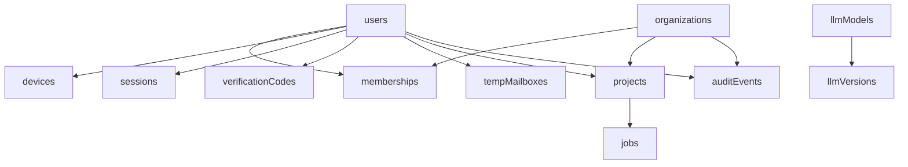
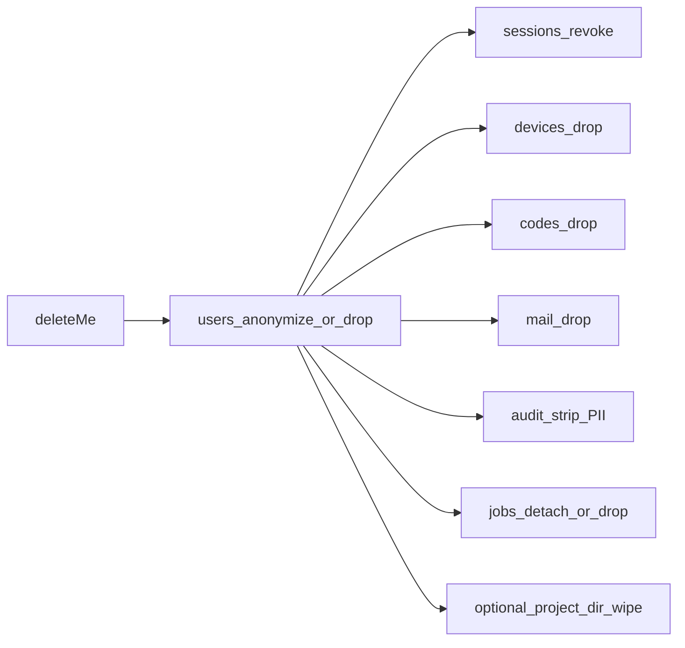

# MongoDB

**Kural:** [.cursor/rules/03-database.mdc](../.cursor/rules/03-database.mdc)

**TR:** Tek platform veritabanı. Müşteri uygulamasının runtime verisi burada tutulmaz.

**EN:** One platform database. The generated app’s runtime data does not live here.

## Koleksiyon ilişkisi / Collection map

## Silme / Delete

## Alan kuralları / Field rules

- Passwords: argon2id or bcrypt. TOTP secret encrypted at rest.
- `verificationCodes.codeHash`, TTL 10 minutes, max attempts.
- `sessions.tokenHash`, unique; at most one `active` per user.
- `projects.diskPath` is a pointer on the machine, not the source tree in GridFS.
- `auditEvents` immutable insert; redacted payload only.
