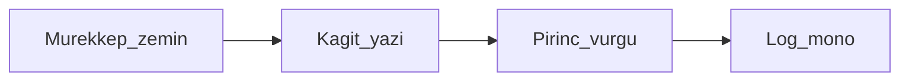
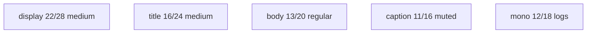

# Tasarım sistemi / Design system

**Kural:** [.cursor/rules/15-design.mdc](../.cursor/rules/15-design.mdc) · hareket: [motion.md](motion.md) · ekranlar: [screens.md](screens.md)

**TR:** Cherry bir tüketici sohbet uygulaması değil; masaüstü atölye aracıdır. Görsel dil sakin, sıkı, metalik bir atölye: mürekkep zemin, kâğıt yazı, tek pirinç vurgu. Mor yapay zekâ gradyanı, cam blob, maskot yok.

**EN:** Cherry is a desktop atelier, not a consumer chat toy. Calm, tight, workshop metal: ink ground, paper type, one brass accent. No purple AI gradients, glass blobs, or mascots.

Referans / references:

- Giriş: [design/cherry-login.png](design/cherry-login.png)
- Stüdyo: [design/cherry-studio.png](design/cherry-studio.png)
- LLM yönetici: [design/cherry-llm-admin.png](design/cherry-llm-admin.png)

Uygulama bu referanslara **yakın** durur; birebir piksel kopyası şart değil, karakter şart.

## Karakter / Character

- Dense desktop (not mobile-first cards stacked to infinity)
- 1px borders, not 12px rounded candy
- One accent color only for primary action and “on” state
- Turkish UI first; English secondary where needed

## Tokenler / Tokens

Kaynak: [design/tokens.css](design/tokens.css). Kod yazılınca shadcn theme bu dosyadan türetilir.

| Token | Değer / Value | Kullanım |
| --- | --- | --- |
| `--bg` | `#0E1114` | pencere |
| `--surface` | `#161B20` | kart, sidebar |
| `--surface-2` | `#1C2329` | hover, inset |
| `--border` | `#2A323A` | 1px |
| `--text` | `#E8E4DC` | birincil yazı |
| `--muted` | `#8B939C` | ikincil |
| `--accent` | `#C4A574` | birincil aksiyon |
| `--accent-hover` | `#D4B896` | hover |
| `--danger` | `#C45C4A` | hata, sil |
| `--success` | `#6F9E7A` | geçti, çalışıyor |
| `--radius` | `8px` | kontroller; kart `10px` max |
| `--font-sans` | Geist, IBM Plex Sans, ui-sans-serif | UI |
| `--font-mono` | IBM Plex Mono, ui-monospace | log, kod, 6 hane |

Light mode: v1 yok. Electron stüdyo koyu kalır (araç; okuma uygulaması değil).

## Tipografi / Type

- Display yalnızca boş durum başlığı ve giriş wordmark
- Body 13px desktop density (14px şişirme)
- Letter-spacing normal; uppercase nav yok (bağırır)

## İkon / Icon

- Lucide (shadcn default), 16px, stroke 1.5
- Renk: `--muted`; aktif `--text`; tek vurgu `--accent`
- Duotone / 3D / emoji ikon yok

## Yasak / Forbidden (slop)

- Mor-pembe AI gradyan, mesh, aurora
- Cam morphism, 20px+ radius, drop-shadow yığınları
- Robot / beyin illüstrasyonu, konfeti
- Her butonda bounce/spring
- “Welcome to your app” / lorem
- İkinci component library
