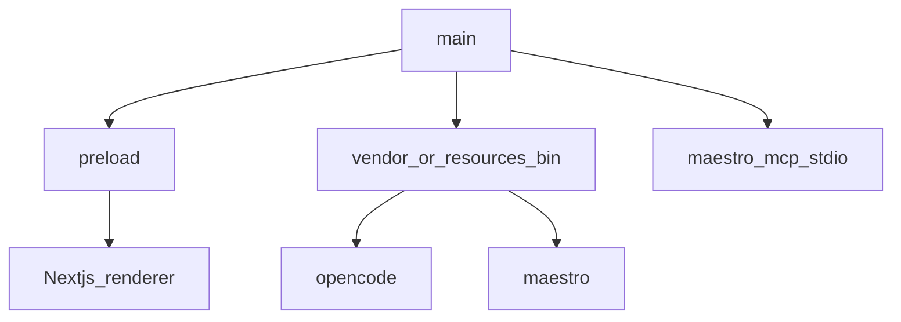

# Electron — masaüstü / desktop

**Kural:** [.cursor/rules/05-desktop.mdc](../.cursor/rules/05-desktop.mdc)

**TR:** Windows ve macOS. Main süreç yerel işleri; renderer yalnızca UI.

**EN:** Windows and macOS. Main owns local work; renderer is UI only.

## Süreç modeli / Process model



Go API çocuk müşteri sürecini başlatır (`activate`). Electron CLI’leri paketler ve `CHERRY_SIDECAR_DIR` yazar.

The Go API starts the generated backend. Electron vendors the CLIs and sets `CHERRY_SIDECAR_DIR`.

## Güvenlik sınırı / Trust boundary


- `nodeIntegration: false`, `contextIsolation: true`.
- Device fingerprint in main only.
- Generated project path stays in userData or a chosen workspace folder.
- **Müşteri OpenCode / Maestro kurmaz.** Kurucu `vendor/bin` veya `process.resourcesPath/bin` doldurur.
- **The customer does not install OpenCode or Maestro.** The installer fills `vendor/bin` or `resources/bin`.
- PATH / `CHERRY_OPENCODE_BIN` / `CHERRY_MAESTRO_BIN` is a **developer fallback** only.
- Missing sidecar: keep scaffold / SKIPPED Maestro. No fake write, no fake pass.

## Kurucu / Release

**TR:** Müşteri Next/Go/OpenCode kurmaz. `npm run dist:desktop` (Win veya Mac makinede) API ikilisini, Next standalone sunucuyu, `vendor/bin` sidecar’larını ve Colab dosyalarını `extraResources` olarak paketler. Paketlenmiş uygulama kendi sürecinde `cherry-api` + Next’i 43148/43147’de açar.

**EN:** The customer does not install Next, Go, or OpenCode. `npm run dist:desktop` on a Windows or Mac machine bundles the API binary, Next standalone server, vendored CLIs, and Colab files as `extraResources`. The packaged app spawns `cherry-api` and Next on 43148/43147.

```bash
./scripts/vendor-sidecars.sh   # once, if vendor/bin is empty
npm run dist:desktop           # Win: NSIS + zip · Mac: dmg + zip
```

Çıktı: `apps/desktop/release-out/`. Linux CI yalnızca unpacked `dir` duman testi üretir — ürün hedefi Win/Mac.

Dev hâlâ üç süreç: `dev:api`, `dev:web`, `dev:desktop` (renderer `http://127.0.0.1:43147`).
