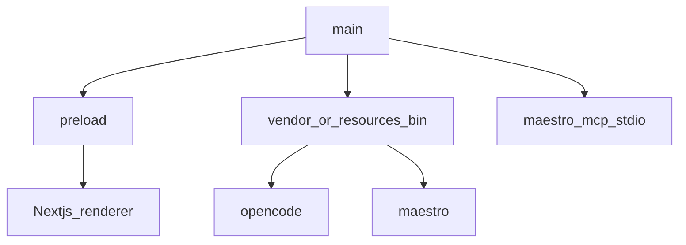

# Electron — masaüstü / desktop

**Kural:** [.cursor/rules/05-desktop.mdc](../.cursor/rules/05-desktop.mdc)

**TR:** Windows ve macOS. Main süreç yerel işleri; renderer yalnızca UI.

**EN:** Windows and macOS. Main owns local work; renderer is UI only.

## Süreç modeli / Process model

Go API çocuk müşteri sürecini başlatır (`activate`). Electron CLI’leri paketler ve `ICERDE_SIDECAR_DIR` yazar.

The Go API starts the generated backend. Electron vendors the CLIs and sets `ICERDE_SIDECAR_DIR`.

## Güvenlik sınırı / Trust boundary

- `nodeIntegration: false`, `contextIsolation: true`.
- Device fingerprint in main only.
- Generated project path stays in userData or a chosen workspace folder.
- **Müşteri OpenCode / Maestro kurmaz.** Kurucu `vendor/bin` veya `process.resourcesPath/bin` doldurur.
- **The customer does not install OpenCode or Maestro.** The installer fills `vendor/bin` or `resources/bin`.
- PATH / `ICERDE_OPENCODE_BIN` / `ICERDE_MAESTRO_BIN` is a **developer fallback** only.
- Missing sidecar: keep scaffold / SKIPPED Maestro. No fake write, no fake pass.
