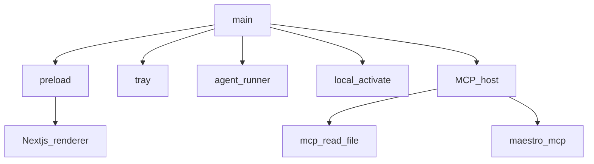
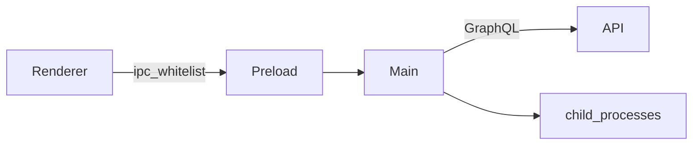

# Electron — masaüstü / desktop

**Kural:** [.cursor/rules/05-desktop.mdc](../.cursor/rules/05-desktop.mdc)

**TR:** Windows ve macOS. Main süreç yerel işleri; renderer yalnızca UI.

**EN:** Windows and macOS. Main owns local work; renderer is UI only.

## Süreç modeli / Process model

## Güvenlik sınırı / Trust boundary

- `nodeIntegration: false`, `contextIsolation: true`.
- Device fingerprint in main only.
- Generated project path stays in userData or a chosen workspace folder.
