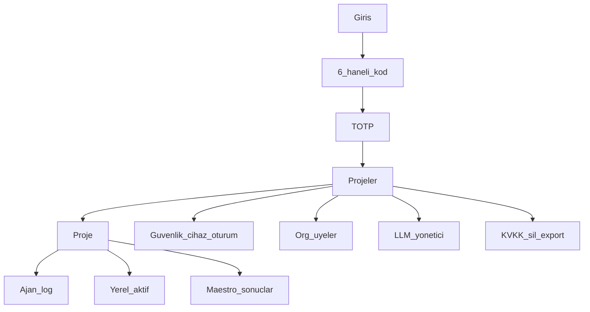
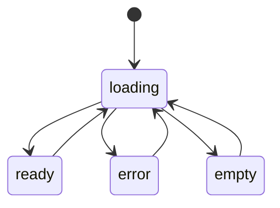

# Next.js UI

**Kural:** [.cursor/rules/04-frontend.mdc](../.cursor/rules/04-frontend.mdc) · [13-typescript.mdc](../.cursor/rules/13-typescript.mdc)

**TR:** Renderer, Electron içinde Next.js’tir. İçerde’nin mobil arayüzü yoktur.

**EN:** The renderer is Next.js inside Electron. Icerde has no mobile UI.

## Ekran haritası / Screen map

## Durumlar / States

Her ekran: `empty` | `loading` | `error` | `ready`.

## UI kuralları / UI rules

- shadcn/ui + Tailwind only. Theme = [design/tokens.css](design/tokens.css), not default violet.
- Visual system: [design-system.md](design-system.md). Motion: [motion.md](motion.md). Layouts: [screens.md](screens.md).
- LLM admin switch is one control; it must call the API and then show the new active model on the next completion.
- Do not fetch Mongo or filesystem from the browser; desktop preload handles files.
