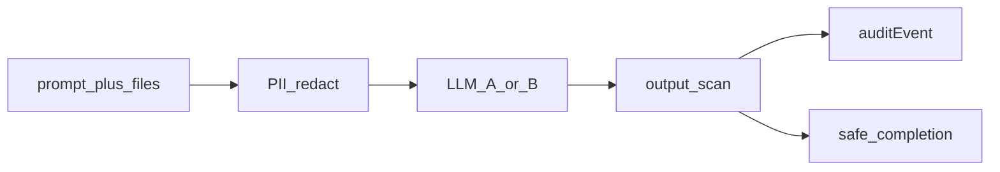
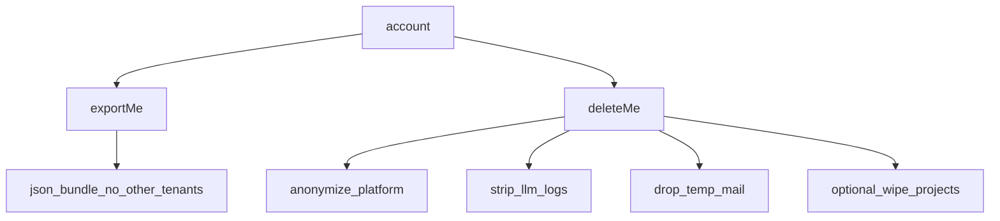

# KVKK / GDPR katmanı

**Kural:** [.cursor/rules/12-gdpr-kvkk.mdc](../.cursor/rules/12-gdpr-kvkk.mdc)

**TR:** LLM’e giden her çağrı sarmalanır. Silme ve dışa aktarma birinci sınıf.

**EN:** Every LLM call is wrapped. Delete and export are first-class.

## Çağrı sarmalayıcı / Call wrapper

## Veri hakları / Data rights

## Ne kesilir / What is redacted

- Email, phone, national id, addresses, auth codes, TOTP, session tokens
- Customer app secrets (API keys in generated `.env`)
- Temp mailbox bodies (our `tempMailboxes`, not a vendor inbox)

Audit stores purpose, legal basis, model version id, redaction counts — not the raw secret.

TR (KVKK) and EU (GDPR) share this pipeline; copy in the privacy screen must name both.
