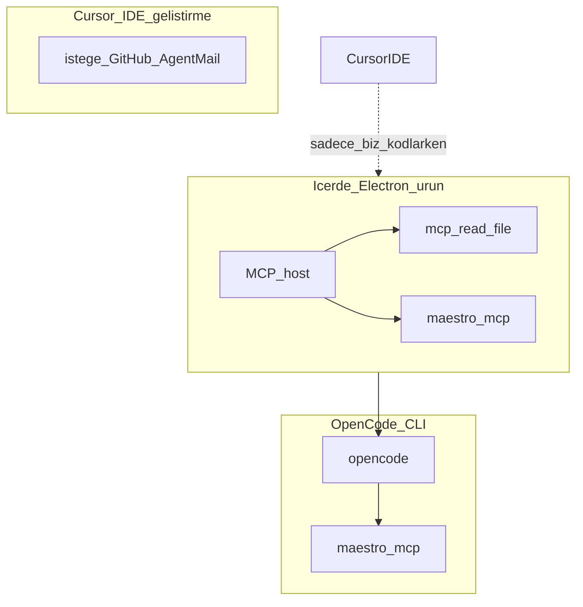

# Entegrasyonlar — MCP, CLI, bağlama

**Kural:** [.cursor/rules/17-integrations.mdc](../.cursor/rules/17-integrations.mdc)

**TR:** Buraya her MCP’yi bağlama. Üç katman var; karışırsa ajan yanlış yere yazar.

**EN:** Do not attach every MCP. Three layers; mixing them makes the agent write in the wrong place.

## 1. Zorunlu — ürünün kendisi / Required for the product

Bunlar **Cursor’a süs için değil**, İçerde ve OpenCode’un çalışması için.

| Ne | Neden | Nasıl |
| --- | --- | --- |
| **Maestro CLI + `maestro mcp`** | UI test; LLM B ekranı görür | `curl -fsSL https://get.maestro.mobile.dev \| bash` sonra `maestro mcp`. Java 17+, `JAVA_HOME`. |
| **OpenCode CLI** | Ajanın kod yazma motoru | OpenCode kurulumu; proje `opencode.json` içinde Maestro bağlı. |
| **Node.js LTS + Go 1.22+ + Docker** | Next.js, GraphQL, Mongo | Docker Compose ile Mongo. |
| **Emülatör** | Maestro’nun gerçek cihazı | Android Studio AVD (Win/Mac). iOS Simulator yalnızca Mac. Yoksa test `skipped`, asla sahte `passed`. |

Maestro **İçerde Electron MCP host** ve **OpenCode** içine bağlanır. Sadece Cursor’a bağlayıp üründe unutmak yetmez.

Örnek: [../opencode.json.example](../opencode.json.example)

## 2. Bağlamanı istediğim — bu Cursor projesi / Connect in this Cursor project

Geliştirirken (İçerde’yi biz yazarken):

| Ne | Durum | Ne işe yarar |
| --- | --- | --- |
| **AgentMail MCP** | Bu oturumda `needsAuth` | Geçici e-posta / 6 haneli kod kutusu. Authenticate et. Ürün tarafında SDK; Cursor’da MCP ile deneme. |
| **GitHub MCP** | İsteğe bağlı ama faydalı | Müşteri teslimi git ise repo açma, PR. Zip-only ise gerekmez. |
| **Maestro MCP** | Geliştirici makinede | Flow’ları sen elle denersin. Ürün host’unun yerine geçmez. |

Örnek: [../.cursor/mcp.json.example](.cursor/mcp.json.example) → kopyala `.cursor/mcp.json` (secret koyma, git’e atma).

## 3. Bağlama / Do not connect

| Ne | Neden |
| --- | --- |
| Figma / Canva MCP | İçerde Figma’dan üretmez (şimdilik). |
| Rastgele filesystem / shell MCP | Electron zaten `mcp_read_file` sunar; kök admin’de. |
| MongoDB MCP | Platform Docker ile konuşur; şart değil. |
| SMS / Twilio | Güvenlik modeli SMS yasak. |

Colab **MCP değil**: Google hesabı + notebook export. Cursor’a bağlanmaz.

## Kurulum sırası / Install order (senin makinen)

1. Java 17+, Node LTS, Go, Docker Desktop
2. Maestro CLI → `maestro --help`
3. OpenCode CLI → `opencode --help`
4. Android emulator (ve Mac’te Xcode sim)
5. Cursor: AgentMail’i authenticate et; isteğe `.cursor/mcp.json`
6. OpenCode: `opencode.json` ile Maestro

Cloud agent ortamında emülatör ağır olabilir; orada Maestro mock/`skipped` kabul.
