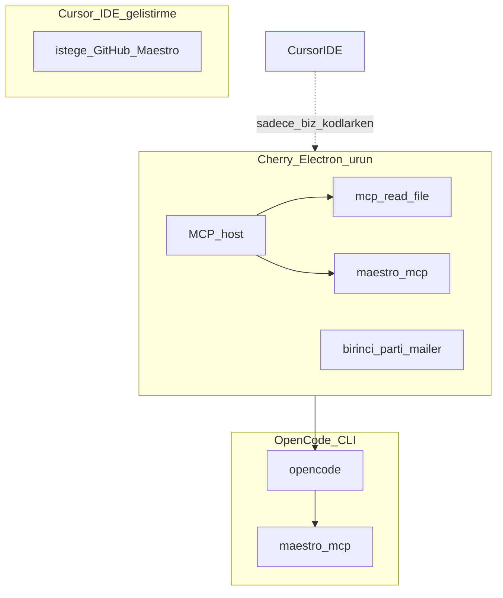

# Entegrasyonlar — MCP, CLI, bağlama

**Kural:** [.cursor/rules/17-integrations.mdc](../.cursor/rules/17-integrations.mdc)

**TR:** Buraya her MCP’yi bağlama. Üç katman var; karışırsa ajan yanlış yere yazar.

**EN:** Do not attach every MCP. Three layers; mixing them makes the agent write in the wrong place.



## 1. Zorunlu — ürünün kendisi / Required for the product

Bunlar **Cursor’a süs için değil**, Cherry ve OpenCode’un çalışması için.

| Ne | Neden | Nasıl |
| --- | --- | --- |
| **Maestro CLI + `maestro mcp`** | UI test; boş işçi (A veya B) ekranı görür | Cherry `vendor/bin`. Geliştirici: `curl -fsSL "https://get.maestro.mobile.dev" \| bash`. Java 17+, `JAVA_HOME`. |
| **OpenCode CLI** | Ajanın kod yazma motoru | Cherry sidecar. Proje `opencode.json` içinde Maestro bağlı. |
| **cloudflared** (isteğe) | Colab’in yereldeki stüdyoya ulaşması | Cherry sidecar. Yoksa tünel `FAILED`, sahte URL yok. [colab.md](colab.md). |
| **Node.js LTS + Go 1.22+ + Docker** | Next.js, GraphQL, Mongo | Docker Compose ile Mongo. |
| **Emülatör** | Maestro’nun gerçek cihazı | Android Studio AVD (Win/Mac). iOS Simulator yalnızca Mac. Yoksa test `skipped`, asla sahte `passed`. |
| **SMTP (prod)** | Bizim e-posta + 6 hane | Env ile mailer. AgentMail yok. Dev: in-app kutu. [email-verification.md](email-verification.md) |

Maestro **Cherry Electron MCP host** ve **OpenCode** içine bağlanır. Sadece Cursor’a bağlayıp üründe unutmak yetmez.

Örnek: [../opencode.json.example](../opencode.json.example)

## 2. Bu Cursor projesinde / In this Cursor project

Geliştirirken (Cherry’yi biz yazarken):

| Ne | Durum | Ne işe yarar |
| --- | --- | --- |
| **GitHub MCP** | İsteğe bağlı | Biz Cherry’yi geliştirirken. Müşteri push’u in-app Bağlantılar. |
| **Maestro MCP** | Geliştirici makinede | Flow’ları sen elle denersin. Ürün host’unun yerine geçmez. |

Örnek: [../.cursor/mcp.json.example](../.cursor/mcp.json.example) → kopyala `.cursor/mcp.json` (secret koyma, git’e atma).

**E-posta / 6 haneli kod için MCP bağlama.** Birinci parti: [email-verification.md](email-verification.md).

## 3. Müşteri bağlantıları (ürün içi) / In-app customer connections

Bu **Cursor MCP’si değildir.** Kişi Cherry’de **Bağlantılar** menüsünden kendi hesaplarını bağlar: Supabase, Cloudflare, GitHub, Vercel, Render.

- Amaç: üretilen uygulamanın backend’i ve teslimi (git/deploy) kişinin platformunda.
- Cherry host olmaz. Platform GraphQL’e karışmaz.
- Belge: [connections.md](connections.md)

GitHub MCP (aşağıdaki Cursor tablosu) **bizim** repo işi içindir; müşterinin “projeyi GitHub’a çek” akışının yerine geçmez.

## 4. Bağlama / Do not connect

| Ne | Neden |
| --- | --- |
| **AgentMail / inbox SaaS MCP** | Mail ve 6 haneyi biz yazıyoruz. |
| Figma / Canva MCP | Cherry Figma’dan üretmez (şimdilik). |
| Rastgele filesystem / shell MCP | Electron zaten `mcp_read_file` sunar; kök admin’de. |
| MongoDB MCP | Platform Docker ile konuşur; şart değil. |
| SMS / Twilio | Güvenlik modeli SMS yasak. |

Colab **MCP değil**: Google hesabı + iki notebook (`colab/cherry_worker_a.ipynb`, `_b.ipynb`). Her oturum **16GB GPU**. Cursor’a bağlanmaz. Tek kartta iki notebook varsayma. Stüdyo ↔ Colab el sıkışması `cloudflared` quick tunnel (LLM yönetici); Bağlantılar’daki Cloudflare Workers değil. Adımlar: [colab.md](colab.md).

## Kurulum sırası / Install order (senin makinen)

1. Java 17+, Node LTS, Go, Docker Desktop
2. Maestro CLI:

```bash
curl -fsSL "https://get.maestro.mobile.dev" | bash
maestro --help
```
3. OpenCode CLI → `opencode --help`
4. Android emulator (ve Mac’te Xcode sim)
5. İsteğe `.cursor/mcp.json` (GitHub / Maestro — **mail yok**)
6. OpenCode: `opencode.json` ile Maestro
7. Prod: `SMTP_*` env

Cloud agent ortamında emülatör ağır olabilir; orada Maestro mock/`skipped` kabul.
