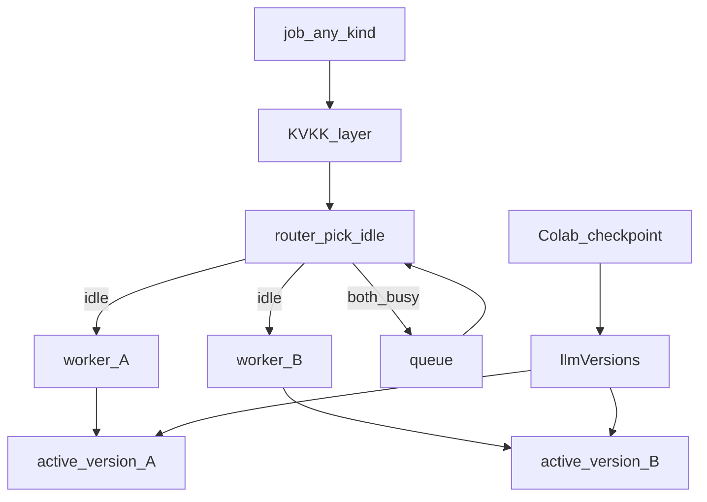
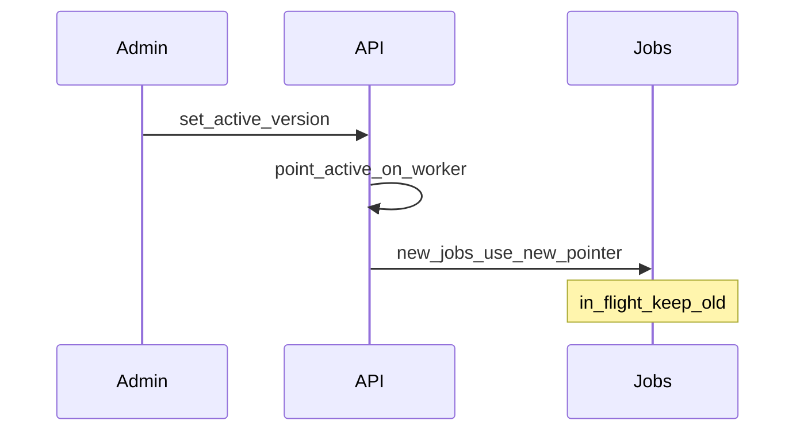
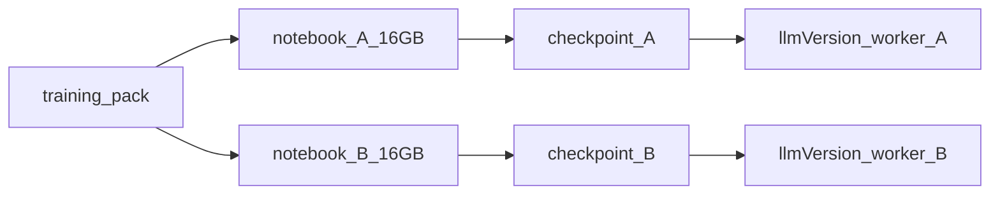

# LLMOps — iki işçi, kuyruk, versiyon, Colab

**Kural:** [.cursor/rules/11-llmops.mdc](../.cursor/rules/11-llmops.mdc)

**TR:** A ve B **aynı işi** yapar. İki yuva, 10 kişi aynı anda üretirken kuyruğu paylaşmak içindir — kod vs test ayrımı değildir.

**EN:** A and B do **the same work**. Two slots exist so ~10 concurrent users can share load — not to split codegen vs test.

## Neden iki / Why two

Tek model bir anda bir tamamlamayı doldurur. Stüdyoda birden fazla kişi (veya bir kişinin birden fazla işi) beklemesin diye ikinci işçi var.

One model fills one completion at a time. The second worker exists so several people in the studio are not stuck behind a single in-flight call.

| Bu / This | Değil / Not |
| --- | --- |
| Kapasite: boş işçiyi al, doluysa kuyruğa yaz | A = kod, B = test |
| Aynı GDPR sarmalı, aynı OpenCode / Maestro araçları | Rol switch’i (“nöbet: test”) |
| Versiyon pointer’ı işçide sonraki cevapları değiştirir | İş türüne göre model kilidi |

## Yönlendirici / Router

Dilim 4: yalnızca **işçi A**. Dilim 7: A ve B kuyruğu paylaşır. Versiyon değiştirmek o işçideki sonraki tamamlamaları değiştirir (in-flight eski pointer’da biter).

Slice 4: **worker A** only. Slice 7 wires B and the queue.

## Versiyon pointer / Version pointer

Default: in-flight jobs finish on the old assignment; queued/new jobs use the new one.

## MCP read-file

Admin sets allowed root (the generated project path). Models read files only under that root.

## Colab

Export training pack → Colab → checkpoint back → new immutable `llmVersion` → admin marks active. Colab is not the production server.

**Karar / Decision:** İki notebook, iki işçi. Aynı anda çalışabilir — **iki ayrı Colab oturumu**, her biri **16GB GPU** (T4 sınıfı). Tek 16GB kartta iki notebook yok.

Two notebooks, two workers. Parallel means **two Colab runtimes**, each with a **16GB GPU** budget (T4-class). One 16GB card does not host both.

| Sabit / Invariant | Neden / Why |
| --- | --- |
| Aynı tarif (LoRA/QLoRA), aynı veri paketi | A ve B yük paylaşır; farklı iş uzmanı değiller |
| 16GB / oturum | Colab T4 bütçesi; tam ağırlık büyük model yok |
| İki oturum = iki GPU hakkı | Paralel fine-tune; tek kartı bölme |
| Colab üretim inferansı değil | Stüdyo işçileri İçerde’de çalışır |

Dilim 8: dosyalar `colab/`, stüdyodan paket indirme, checkpoint → `registerLlmVersion`. Colab üretim inferansı değil.

Slice 8: files in `colab/`, studio pack download, checkpoint → `registerLlmVersion`. Colab is not production inference.

Adım adım: [colab.md](colab.md)
