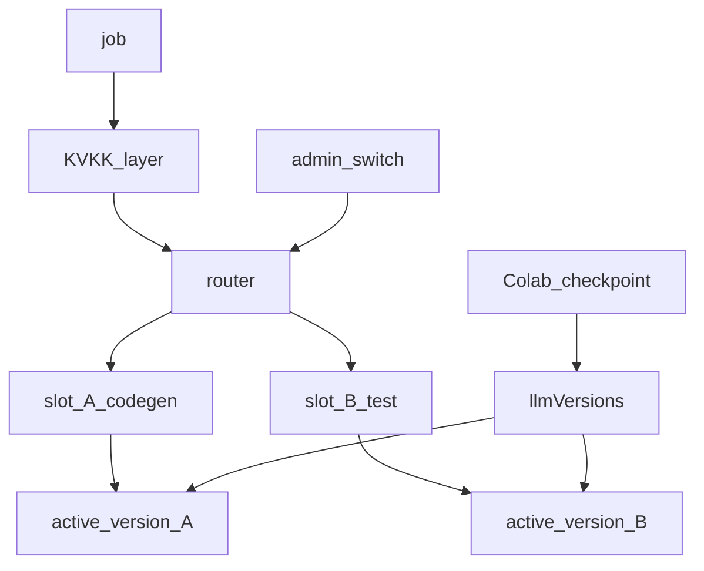
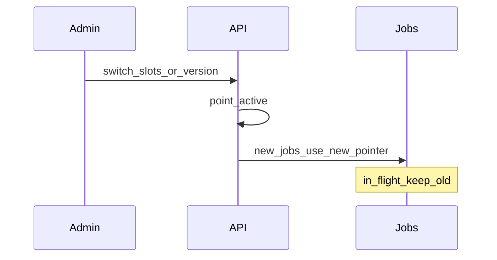
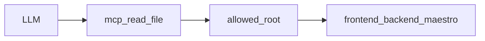

# LLMOps — iki model, switch, versiyon, Colab

**Kural:** [.cursor/rules/11-llmops.mdc](../.cursor/rules/11-llmops.mdc)

**TR:** İki çalışma yuvası. Yönetici değiştirince **sonraki cevaplar** değişir.

**EN:** Two runtime slots. After the admin switches, **later answers** change.

## Yönlendirici / Router

## Switch

Default: in-flight jobs finish on the old assignment; queued/new jobs use the new one.

## MCP read-file

Admin sets allowed root (the generated project path). Models read files only under that root.

## Colab

Export training pack → Colab → checkpoint back → new immutable `llmVersion` → admin marks active. Colab is not the production server.
