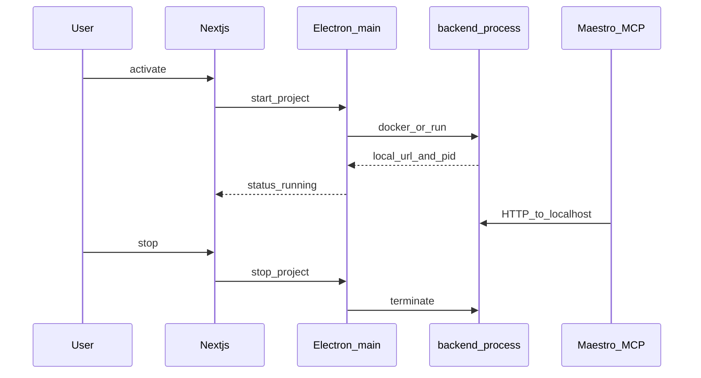
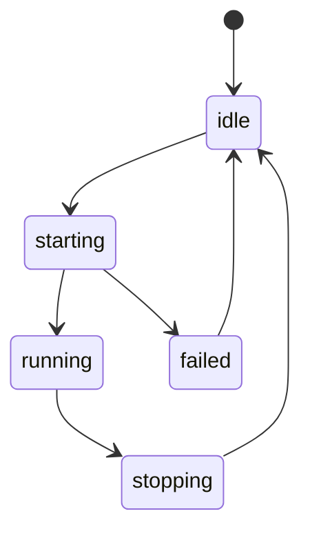

# Yerel aktif / Local activate

**Kural:** [.cursor/rules/09-local-activate.mdc](../.cursor/rules/09-local-activate.mdc)

**TR:** Test için üretilen backend **localhost**’ta ayağa kalkar. Public barındırma yoktur.

**EN:** For tests, the generated backend boots on **localhost**. No public hosting.

## Aktivasyon / Activation

## Durum makinesi / Status

## Portlar / Ports

- Icerde UI/API: uncommon ports (avoid 3000 / 5173 / 8080 when possible).
- Generated app: isolated range, recorded on the job (example `127.0.0.1:47000+`).
- Child process must not be the platform `services/api` binary.
