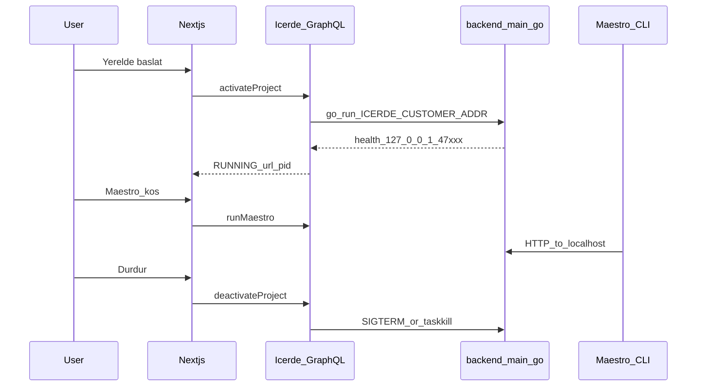
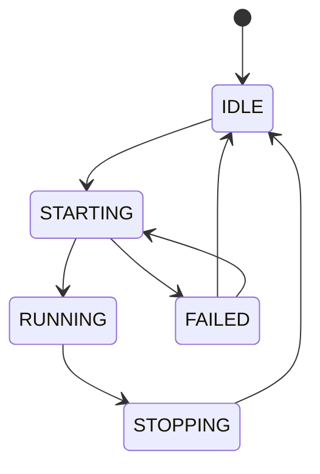

# Yerel aktif / Local activate

**Kural:** [.cursor/rules/09-local-activate.mdc](../.cursor/rules/09-local-activate.mdc)

**TR:** Test için üretilen backend **localhost**’ta ayağa kalkar. Public barındırma yoktur. Süreç platform GraphQL sürecinin *içinde* dinlemez; `go run backend/main.go` çocuk süreçtir.

**EN:** For tests, the generated backend boots on **localhost**. No public hosting. It does not ListenAndServe inside the platform process; it is a child `go run backend/main.go`.

## Aktivasyon / Activation

Dilim 6: GraphQL `activateProject` / `deactivateProject`. Electron sidecar dizinini işaretler; çocuk süreci Go API başlatır.

Slice 6: GraphQL `activateProject` / `deactivateProject`. Electron points at the sidecar dir; the Go API starts the child.

## Durum makinesi / Status

## Portlar / Ports

- Icerde UI `43147`, API `43148`.
- Generated app: **47000–47999**, recorded on `Project.activate`.
- Child env: `ICERDE_CUSTOMER_ADDR=127.0.0.1:<port>`.
- Pipeline TESTING starts the child, runs Maestro, then **stops** so jobs do not leak. The person can start it again from the studio column.
