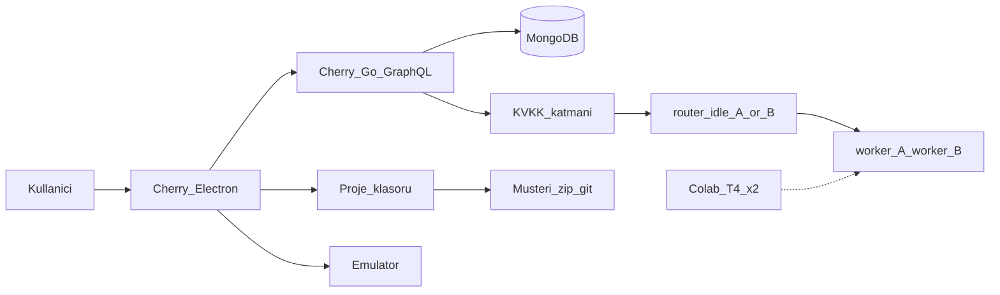
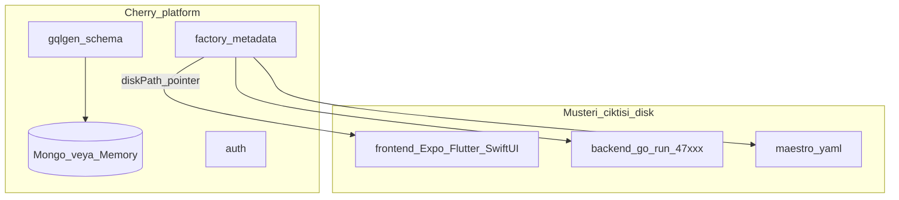
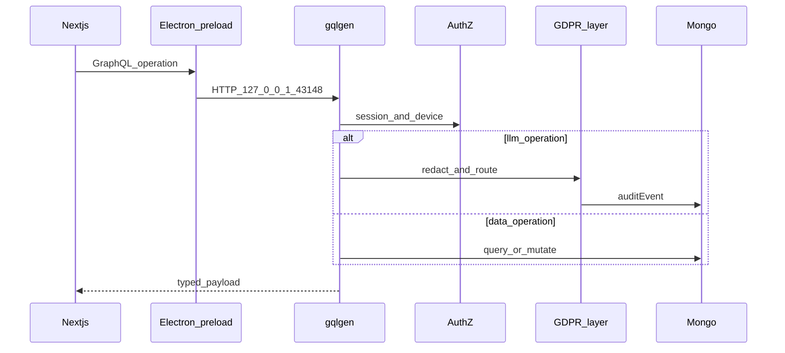
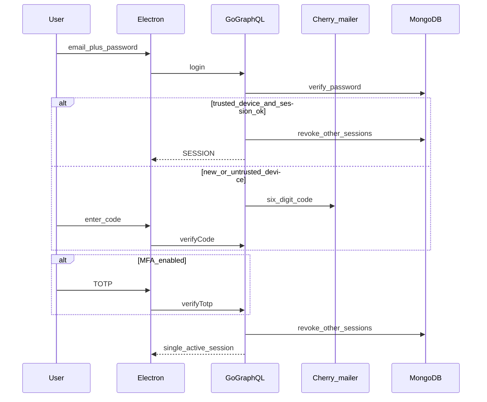
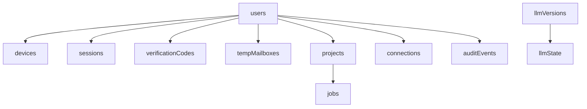
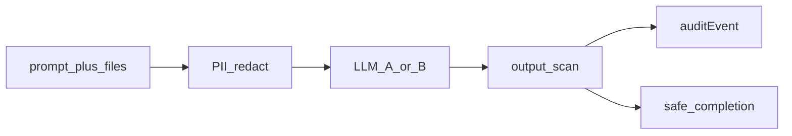
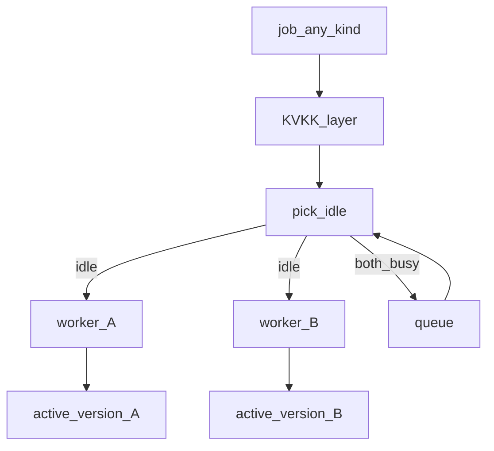
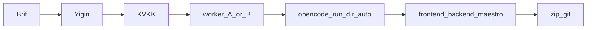

# Cherry — Low Level Architecture

**TR:** Cherry bir Electron masaüstü stüdyosudur (Windows + macOS). Kendisi mobil uygulama değildir. Platform API’si Go GraphQL + MongoDB’dir. Üretilen müşteri uygulaması ayrı dosyalardır (Expo / Flutter / SwiftUI + Clean Architecture); v1’de Cherry bunları barındırmaz.

**EN:** Cherry is an Electron desktop studio (Windows + macOS). It is not a mobile app. The platform API is Go GraphQL + MongoDB. The generated customer app is files on disk (Expo / Flutter / SwiftUI + Clean Architecture). Cherry does not host those backends in v1.

Repo: [github.com/emrahyasinisik/Cherry](https://github.com/emrahyasinisik/Cherry)

---

## 1. Sabitler / Invariants

| # | TR | EN |
| --- | --- | --- |
| 1 | İki backend karışmaz: platform GraphQL ≠ müşteri `backend/` dosyaları | Never mix platform GraphQL with generated customer backend files |
| 2 | Teslim klasör / zip / git; zip içinde `preview/` HTML yok | Handoff is files; zip is the stack language, never `preview/` HTML |
| 3 | UI LLM’e doğrudan gitmez | UI never calls an LLM directly |
| 4 | İşçi A ve B aynı iş türü; ikinci yuva eşzamanlı yük içindir | Workers A and B are the same kind of job; B is capacity, not “tests” |
| 5 | Her LLM çağrısı: redact → model → scan → audit | Every LLM call goes through KVKK/GDPR |
| 6 | SMS yok; telefon kimlik değil; hesap başına tek aktif oturum | No SMS, no phone identity, one active session |
| 7 | OpenCode yeniden yazılmaz; CLI çağrılır | OpenCode is invoked, not reimplemented |

---

## 2. Süreçler ve portlar / Processes and ports

```
Kullanıcı makinesi
├── Electron main  (apps/desktop)     pencere, tepsi, IPC, sidecar env
│     └── preload                     GraphQL + cihaz parmak izi köprüsü
│           └── Next.js renderer      UI  http://127.0.0.1:43147
├── cherry-api (Go)                   GraphQL 127.0.0.1:43148
│     ├── store: Mongo veya bellek
│     ├── LLM router A/B + kuyruk
│     ├── OpenCode child              vendor/bin/opencode
│     ├── Maestro child               vendor/bin/maestro  (cihaz yoksa SKIPPED)
│     └── müşteri backend child       go run backend/main.go  127.0.0.1:47000–47999
└── Colab köprü (isteğe)              127.0.0.1:43149  (GraphQL dinleyicisi tünellenmez)
      └── cloudflared quick tunnel    yalnızca pack/checkpoint el sıkışması
```

| Dinleyici | Adres | Ne |
| --- | --- | --- |
| Next renderer | `127.0.0.1:43147` | Ekranlar |
| Platform API | `127.0.0.1:43148` | GraphQL + `/health` + `/export/:id` + `/colab/*` + `/oauth/*` |
| Colab bridge | `127.0.0.1:43149` | `GET /pack.json`, `GET /pack.jsonl`, `POST /checkpoint` (token) |
| Müşteri API | `127.0.0.1:47000–47999` | Yerel test; platform sürecinin içinde ListenAndServe yok |
| Colab inferans | harici `/v1` | `setColabInferenceUrl` — örn. named Cloudflare tunnel |

Dev:

```bash
npm install                 # yalnızca repo kökü
npm run dev:api             # 43148
npm run dev:web             # 43147
npm run dev:desktop
./scripts/vendor-sidecars.sh
```

Paketlenmiş uygulama (Win/Mac) kendi sürecinde API + Next’i aynı portlarda açar.

---

## 3. Sistem bağlamı / System context



**İki backend sınırı / Two-backend boundary**



Platform koleksiyonlarında müşteri runtime verisi tutulmaz. `projects.diskPath` makinedeki klasöre işaret eder; kaynak ağacı GridFS’te değildir.

---

## 4. Repo düzeni / Repository layout

```
package.json                 npm workspaces — tek lockfile
apps/web                     Next.js renderer (cherry-web)
apps/desktop                 Electron main + preload (cherry-desktop)
services/api                 Go GraphQL (ayrı Go module)
docs/                        çizimler ve sabitler
colab/                       worker_a / worker_b notebook + seed pack
vendor/bin                   OpenCode + Maestro (gitignore; vendor script)
```

Go paketleri (`services/api/internal/`):

| Paket | Sorumluluk |
| --- | --- |
| `auth` | kayıt, giriş, 6 hane, TOTP, cihaz, tek oturum |
| `mailer` | birinci parti kutu; AgentMail yok |
| `store` | `Memory` veya `Mongo` (`MONGO_URI`) |
| `factory` | iskelet yazımı, yığın (Expo/Flutter/SwiftUI), zip metadata |
| `opencode` | `opencode run --dir --auto` |
| `activate` | müşteri `go run` çocuk süreç, 47xxx |
| `maestro` | cihaz yoksa SKIPPED, sahte PASSED yok |
| `llm` | completer, A/B kuyruk, versiyon pointer, training pack |
| `gdpr` | PII redact, çıktı tarama, MCP kök |
| `colabbridge` | 43149 + cloudflared |
| `connect` | OAuth + GitHub push (kişinin hesabı) |
| `sidecar` | CLI arama: env → vendor → PATH |
| `crypto` | argon2id/bcrypt, TOTP, hash |

UI asla LLM HTTP’sine gitmez. Renderer → preload IPC (beyaz liste) → GraphQL.

---

## 5. İstek yolu / Request path



Sözleşme: `services/api/graph/schema.graphqls`. Swagger yok. Health: `GET /health`.

### Query

`health`, `me`, `projects`, `project`, `maestroStudio`, `devices`, `sessions`, `mailbox`, `challengeMailbox`, `llmAdmin`, `llmStatus`, `mcpReadFile`, `exportMe`, `trainingPack`, `connections`, `colabBridge`, `colabInferenceA`, `colabInferenceB`

### Mutation

Auth: `register`, `login`, `verifyCode`, `verifyLink`, `verifyTotp`, `enableTotp`, `confirmTotp`, `disableTotp`, `revokeSession`, `revokeDevice`, `logout`

Fabrika: `createProject`, `sendProjectMessage`, `activateProject`, `deactivateProject`, `runMaestro`

Bağlantılar: `connectProvider`, `startConnectionOAuth`, `completeConnectionOAuth`, `disconnectProvider`, `pushProjectGithub`

LLMOps: `setActiveVersion`, `setMcpRoot`, `registerLlmVersion`, `startColabBridge`, `stopColabBridge`, `setColabInferenceUrl`

Gizlilik: `deleteMe(wipeProjects)`

---

## 6. Auth (X-inspired)



- Parola: argon2id veya bcrypt. TOTP sırı dinlenme anında şifreli.
- 6 hane: hash, ~10 dk TTL, deneme kilidi. Düz kod saklanmaz.
- `verifyLink` e-posta bağlantısı.
- Cihaz parmak izi Electron main’de; renderer `nodeIntegration: false`, `contextIsolation: true`.
- SMS / telefon kimliği yok. Birinci parti `tempMailboxes` (AgentMail yok).
- `LoginNext`: `SESSION` | `DEVICE_CODE` | `TOTP`

---

## 7. MongoDB

Tek platform veritabanı (`cherry` veya `MONGO_URI` path). Ping başarısızsa bellek store.



| Koleksiyon | Dizin |
| --- | --- |
| `users` | unique `email` |
| `sessions` | unique `tokenHash`; `userId` |
| `devices` | unique `(userId, fpHash)` |
| `verificationCodes` | `linkHash`; `(userId, purpose)`; TTL `expiresAt` |
| `tempMailboxes` | `userId`, `challengeId` |
| `projects` | `(userId, createdAt desc)` |
| `jobs` | `(projectId, at)` |
| `connections` | unique `(userId, kind)` |
| `llmVersions` | `(slot, createdAt desc)` |
| `auditEvents` | `(userId, createdAt desc)` |

`deleteMe`: oturum iptal, cihaz/kod/kutu düşürme, denetim PII sıyırma, işleri koparma, isteğe proje klasörü silme.

---

## 8. KVKK / GDPR katmanı



Kesilenler: e-posta, telefon, TCKN, adres, auth kodu, TOTP, oturum token, müşteri `.env` sırları, kutu gövdeleri.

Denetim: amaç, hukuki dayanak, model version id, redaksiyon sayıları — ham sır değil.

`trainingPack` ≠ `exportMe`. Pack, Colab için redakte SFT satırlarıdır; başka kiracı yok.

---

## 9. LLMOps — A/B kuyruk

A ve B **aynı işi** yapar. İki yuva ~10 eşzamanlı kullanıcı içindir.



- Boş işçi alınır; ikisi meşgulse kuyruk.
- `setActiveVersion` sonraki işleri çevirir; in-flight eski pointer’da biter.
- Anahtar yoksa `mock`; `CHERRY_LLM_API_KEY` varsa HTTP. `setColabInferenceUrl(slot, url)` yuvayı `colab-tunnel` yapar. Health: `GET {url}/models` — URL `/v1` içermeli.
- MCP `mcpReadFile` yalnızca admin `mcpRoot` altı.

Colab: iki notebook, **iki T4 oturumu**. Fine-tune dosyadır; üretim sunucusu değildir. Named tunnel Colab tarafında; pack köprüsü stüdyo `cloudflared` quick tunnel.

---

## 10. Mobil fabrika + OpenCode



| Yığın | Dil | Clean Architecture |
| --- | --- | --- |
| Expo | SDK 57, TS, RN 0.86 | `src/domain` `data` `presentation` `app` |
| Flutter | 3.47 / Dart 3.13 | `lib/features/<x>/{domain,data,presentation}` |
| SwiftUI | Swift 6, iOS 18+ | `Domain` `Data` `Presentation` `App` |

```bash
opencode run --dir <absoluteProjectRoot> --auto
```

`--dir` mutlak olmalı. Kişi OpenCode TUI görmez. CLI yoksa iskelet kalır; sahte yazım yok.

Yerel aktif: `activateProject` → çocuk `go run` + `CHERRY_CUSTOMER_ADDR`. Maestro cihaz yoksa **SKIPPED**. Pipeline TESTING çocuğu durdurur.

Backend hedefi Bağlantılar’dan (LOCAL / Supabase / Cloudflare / Render). GitHub push kişinin OAuth hesabı. Cherry host değil.

---

## 11. Masaüstü paket / Desktop package

Electron 37, `contextIsolation`. Sidecar sırası: `CHERRY_*_BIN` → `CHERRY_SIDECAR_DIR` → `vendor/bin` → PATH.

`npm run dist:desktop` (Win/Mac): Next standalone + `cherry-api` + sidecar + `colab/` → `apps/desktop/release-out/`. Linux CI yalnızca unpacked duman testi.

---

## 12. Ortam / Environment (özet)

| Değişken | İş |
| --- | --- |
| `MONGO_URI` | Platform Mongo; yoksa bellek |
| `CHERRY_LLM_API_KEY` | HTTP completer + OpenCode `OPENAI_API_KEY` |
| `CHERRY_OPENCODE_BIN` / `CHERRY_MAESTRO_BIN` | Geliştirici yedek yolu |
| `CHERRY_SIDECAR_DIR` | Paketlenmiş `resources/bin` |
| `CHERRY_GITHUB_CLIENT_ID` + secret | Gerçek GitHub OAuth |
| SMTP / Resend | Üretim posta; yoksa stüdyo içi kutu |

Colab Secret olarak **yalnızca** tünel token / public URL. Cherry API, Mongo, SMTP, oturum token Colab’e konmaz.

---

## 13. Bu mimaride olmayan / Out of scope (v1)

- Cherry mobil istemcisi
- Müşteri backend barındırma / public URL
- SMS, telefon kimliği, çoklu eşzamanlı oturum
- Swagger (sözleşme GraphQL şeması)
- Postgres / Redis / Kafka
- OpenCode’un yeniden yazımı
- Organizasyon UI (kişisel `workspaceKind` var; org ekranı kapalı)

Kaynak belgeler: `docs/architecture.md`, `backend-graphql.md`, `database.md`, `security.md`, `llmops.md`, `gdpr-kvkk.md`, `desktop.md`, `mobile-factory.md`.
