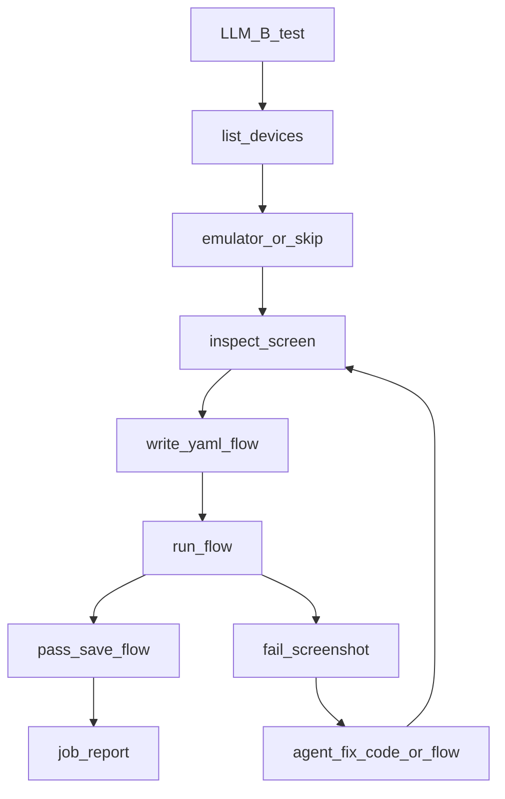
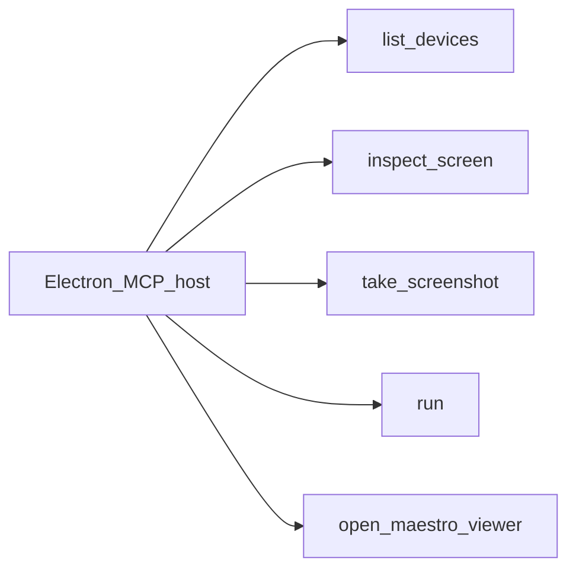

# Maestro MCP

**Kural:** [.cursor/rules/10-maestro.mdc](../.cursor/rules/10-maestro.mdc)

**TR:** UI denemesi Maestro MCP ile. Flow’lar müşteri dosyalarına yazılır.

**EN:** UI trials go through Maestro MCP. Flows are written into the customer files.

## Test döngüsü / Test loop

## MCP araçları / MCP tools

## Kurallar / Rules

- YAML under `maestro/` ships with zip/git.
- No emulator: status `skipped`, never `passed`.
- Bound repair attempts (suggested max 3 per flow) then fail the job.
- Maestro talks to the **locally activated** customer API, not Icerde GraphQL.
