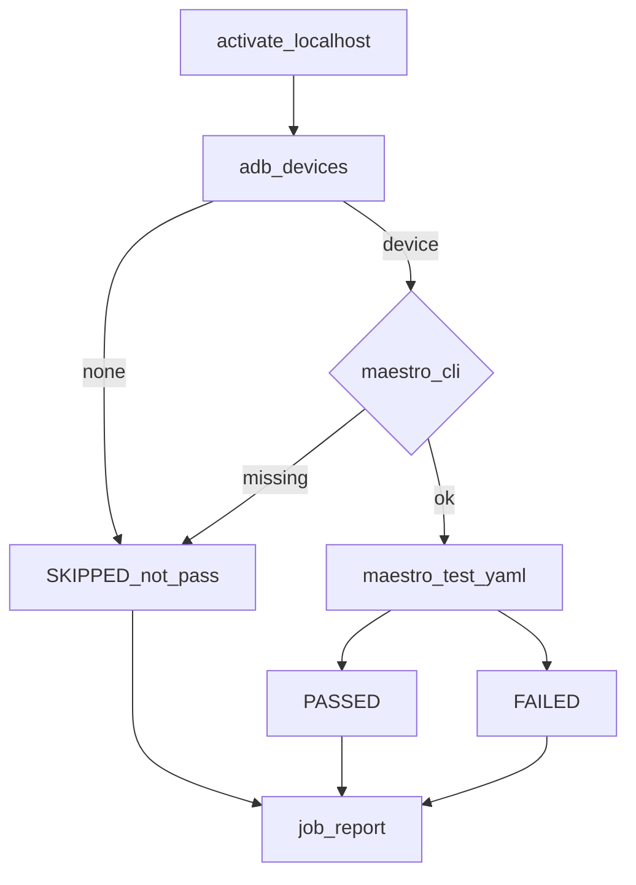
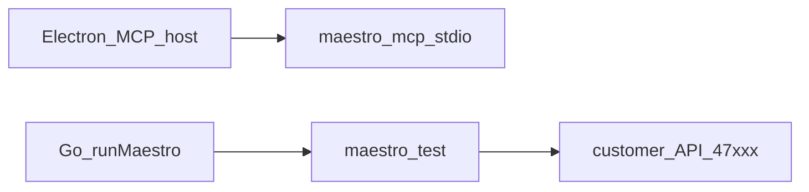

# Maestro MCP

**Kural:** [.cursor/rules/10-maestro.mdc](../.cursor/rules/10-maestro.mdc)

**TR:** UI denemesi Maestro ile. Flow’lar müşteri dosyalarına yazılır. Cihaz yoksa **SKIPPED**; PASSED uydurulmaz.

**EN:** UI trials go through Maestro. Flows are written into the customer files. No device → **SKIPPED**; never fake PASSED.

## Kurulum / Install

Müşteri Maestro kurmaz. Cherry `vendor/bin` (veya `resources/bin`) paketler. Geliştirici PATH / `CHERRY_MAESTRO_BIN` yedek.

The customer does not install Maestro. Cherry vendors it. PATH is a developer fallback.

```bash
./scripts/vendor-sidecars.sh   # downloads OpenCode + Maestro zip (Java 17+)
# or, developer machine only:
curl -fsSL "https://get.maestro.mobile.dev" | bash
```

Electron main, CLI varsa `maestro mcp` (stdio) ayağa kaldırır; yoksa host boş kalır, akışlar SKIPPED.

## Emülatör / Device (PASSED için)

**TR:** PASSED yalnızca gerçek cihaz veya emülatörde. Cloud agent’ta emülatör yoksa SKIPPED doğru kalır.

**EN:** PASSED only with a real device or emulator. No emulator in cloud → SKIPPED is correct.

| Platform | Ne |
| --- | --- |
| Android | Android Studio AVD; `adb devices` → `device` |
| iOS (Mac) | Simulator booted; `xcrun simctl list devices booted` |
| Seçim | `CHERRY_MAESTRO_DEVICE=<id>` |
| Otomatik aç | `CHERRY_MAESTRO_START_DEVICE=1` → `maestro start-device` (SDK gerekir) |

```bash
# Android AVD örneği
emulator -avd Pixel_6_API_34 &
adb wait-for-device
npm run dev:api
# Studio → Maestro → Koş → PASSED veya FAILED (SKIPPED değil)
```

Runner: `maestro --device <id> test flow.yaml`. FAILED en fazla **3** deneme; sonra FAILED kalır. PASSED asla uydurulmaz.

## Test döngüsü / Test loop



`runMaestro` GraphQL mutasyonu stüdyo ve Maestro ekranından. Pipeline TESTING aynı koşucuyu kullanır, sonra yerel API’yi kapatır.

## MCP araçları / MCP tools



Maestro **Cherry GraphQL’e değil**, yerelde aktif müşteri API’sine konuşur.

## Kurallar / Rules

- YAML under `maestro/` ships with zip/git.
- No emulator → `deviceStatus: none`, flows `SKIPPED`, never `PASSED`.
- No Maestro CLI → `deviceStatus: no_cli` (even if a device is visible), flows `SKIPPED`. UI labels distinguish CLI missing vs device missing.
- Bound repair attempts (suggested max 3 per flow) then fail the job.
- Maestro talks to the **locally activated** customer API, not Cherry GraphQL.

Stüdyo metni: CLI yok → “Maestro CLI yok…”; cihaz yok → “Cihaz yok…”. `SKIPPED` etiketi yalnızca “Atlandı” — neden notta.

Studio copy: CLI missing vs device missing are separate. Result label is just “Atlandı”; the note carries why.
