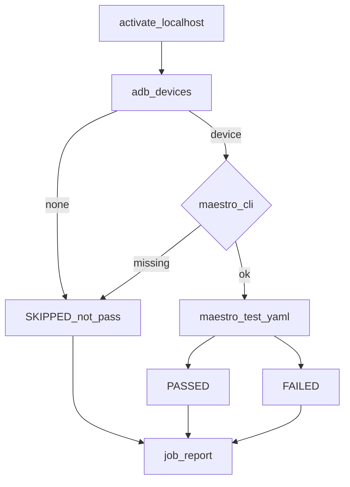
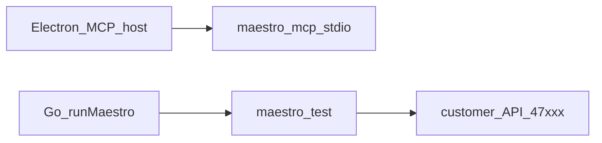

# Maestro MCP

**Kural:** [.cursor/rules/10-maestro.mdc](../.cursor/rules/10-maestro.mdc)

**TR:** UI denemesi Maestro ile. Flow’lar müşteri dosyalarına yazılır. Cihaz yoksa **SKIPPED**; PASSED uydurulmaz.

**EN:** UI trials go through Maestro. Flows are written into the customer files. No device → **SKIPPED**; never fake PASSED.

## Kurulum / Install

Müşteri Maestro kurmaz. İçerde `vendor/bin` (veya `resources/bin`) paketler. Geliştirici PATH / `ICERDE_MAESTRO_BIN` yedek.

The customer does not install Maestro. Icerde vendors it. PATH is a developer fallback.

```bash
./scripts/vendor-sidecars.sh
# or, developer machine only:
curl -fsSL "https://get.maestro.mobile.dev" | bash
```

Electron main, CLI varsa `maestro mcp` (stdio) ayağa kaldırır; yoksa host boş kalır, akışlar SKIPPED.

## Test döngüsü / Test loop



`runMaestro` GraphQL mutasyonu stüdyo ve Maestro ekranından. Pipeline TESTING aynı koşucuyu kullanır, sonra yerel API’yi kapatır.

## MCP araçları / MCP tools



Maestro **Icerde GraphQL’e değil**, yerelde aktif müşteri API’sine konuşur.

## Kurallar / Rules

- YAML under `maestro/` ships with zip/git.
- No emulator / no CLI: status `SKIPPED`, never `PASSED`.
- Bound repair attempts (suggested max 3 per flow) then fail the job.
- Maestro talks to the **locally activated** customer API, not Icerde GraphQL.
