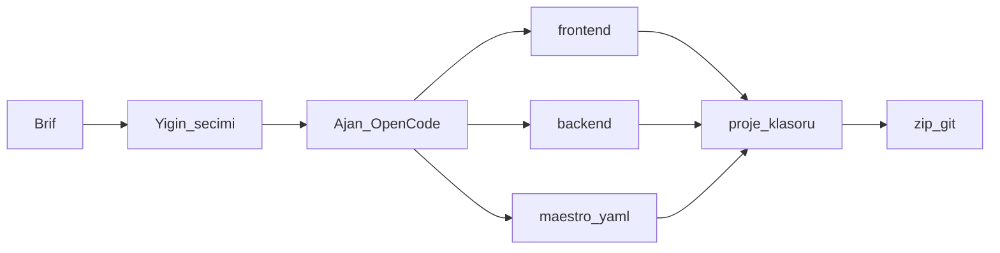
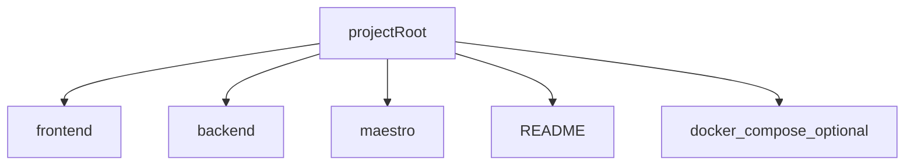
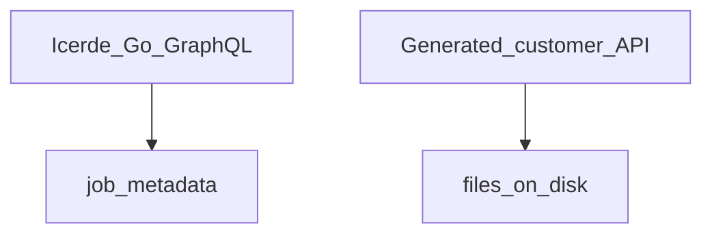

# Mobil fabrika / Mobile factory

**Kural:** [.cursor/rules/08-mobile-factory.mdc](../.cursor/rules/08-mobile-factory.mdc)

**TR:** İçerde mobil uygulama **yazar**. Kendisi mobil değildir. Yığını kullanıcı seçer.

**EN:** Icerde **writes** mobile apps. It is not a mobile app. The user picks the stack.

## Boru hattı / Pipeline

## Çıktı ağacı / Output tree

## Yığın / Stack

Adapters behind one interface, for example:

- Expo / React Native
- Flutter
- Native iOS + Android

v1 may implement one adapter fully; others stay as explicit “not wired” rather than fake success.

## İki backend / Two backends

Müşteriye dosya verilir. Kaynak müşterinin.
