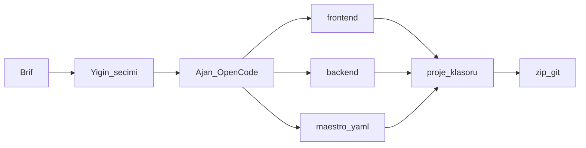
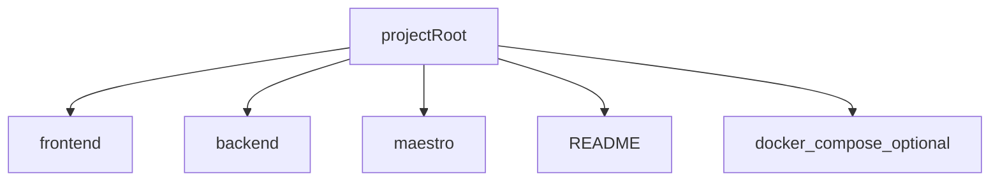
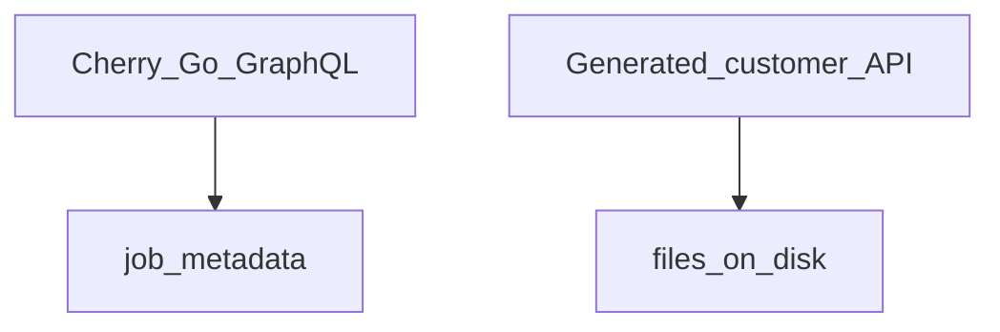

# Mobil fabrika / Mobile factory

**Kural:** [.cursor/rules/08-mobile-factory.mdc](../.cursor/rules/08-mobile-factory.mdc)

**TR:** Cherry mobil uygulama **yazar**. Kendisi mobil değildir. Yığını kullanıcı seçer.

**EN:** Cherry **writes** mobile apps. It is not a mobile app. The user picks the stack.

## Boru hattı / Pipeline

## Çıktı ağacı / Output tree

**Teslim / Handoff:** Zip ve git, seçilen yığının **dilinde** ve **Clean Architecture** ile kaynaktır — HTML site değildir.

| Yığın | Dil (güncel) | Mimari | Örnek |
| --- | --- | --- | --- |
| Expo | SDK 57, TypeScript strict, React 19, RN 0.86 | `src/domain` `src/data` `src/presentation` `src/app` + Expo Router `app/` | `frontend/src/domain/entities` |
| Flutter | 3.47 / Dart 3.13 | `lib/features/<özellik>/{domain,data,presentation}` | `frontend/lib/features/home/domain` |
| SwiftUI (`NATIVE`) | Swift 6, iOS 18+, `@Observable` | `Domain` `Data` `Presentation` `App` | `frontend/Presentation/Home` |

OpenCode mevcut katmanları genişletir; tek `App.js` / `main.dart` / `ContentView.swift` içine yığmaz.

`preview/*.html` stüdyo / Maestro maketidir; zip’e **girmez**. Stüdyo dosya listesi `frontend/` öne çıkar.

**Backend hedefi:** Kişi Bağlantılar’dan seçer (yerel, Supabase, Cloudflare, …). Ayrıntı: [connections.md](connections.md). Cherry barındırmaz.

## Yığın / Stack

Adapters behind one interface, for example:

- Expo (SDK 57, TypeScript, Clean Architecture)
- Flutter (3.47 / Dart 3.13, Clean Architecture)
- SwiftUI (Swift 6, Clean Architecture; GraphQL değeri `NATIVE`)

v1 üç adaptör de Clean Architecture iskeleti yazar; OpenCode katmanları doldurur. Sahte “tamamlandı” yok.

## Stüdyo akışı / Studio flow

Kişi brifi yazar. Ajan **arka planda** `frontend/`, `backend/`, `maestro/` üretir. Test aşamasına gelince (veya kişi isterse) Maestro ekranı açılır: üretilen tasarım maketleri + YAML. Cihaz yoksa sonuç `SKIPPED`.

The user writes a brief. **OpenCode** writes `frontend/`, `backend/`, `maestro/` **in the background** (`opencode run --dir`, GDPR-wrapped prompt). At the test stage (or on demand) the Maestro screen opens: design mocks + YAML. No device → `SKIPPED`. Missing OpenCode CLI keeps the scaffold — never a fake write.

## İki backend / Two backends

Müşteriye dosya verilir. Kaynak müşterinin.
