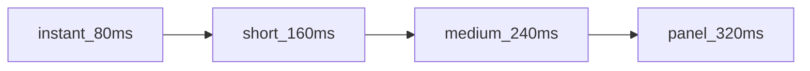
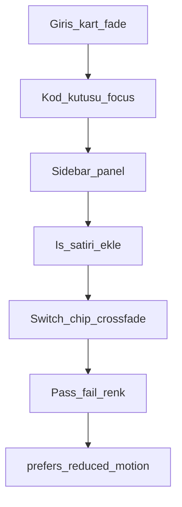

# Hareket / Motion

**Kural:** [.cursor/rules/16-motion.mdc](../.cursor/rules/16-motion.mdc) · görsel: [design-system.md](design-system.md)

**TR:** Animasyon süs değil; durum değişimini okunur kılar. Kısa, aynı easing, `prefers-reduced-motion` zorunlu.

**EN:** Motion explains state changes. Short, one easing family, `prefers-reduced-motion` required.

## Süreler / Durations



| Token | ms | Ne / What |
| --- | --- | --- |
| `--motion-instant` | 80 | renk, border, focus ring |
| `--motion-short` | 160 | buton, chip, 6-haneli kutu |
| `--motion-medium` | 240 | fade, liste satırı |
| `--motion-panel` | 320 | sidebar, sheet, dialog |
| `--motion-stagger` | 30 | liste; en fazla 5 öğe |

Hiçbir şey 400ms’yi geçmez (sayfa geçişi dahil). Looping süsleme yok.

## Easing

```css
--ease-out: cubic-bezier(0.16, 1, 0.3, 1);
--ease-in: cubic-bezier(0.4, 0, 1, 1);
--ease-linear: linear;
```

- Enter: `--ease-out` + opacity + 4–8px translateY
- Exit: `--ease-in` + opacity (daha kısa)
- Progress bar, log scroll: linear
- **Yasak:** bounce, elastic, back, 3D rotate/flip, rubber, confetti

## Ne animasyonlanır / What moves



1. **Auth:** kart 240ms fade+4px; 6 hane focus 80ms ring; hatalı kod 160ms border `--danger` (shake yok).
2. **Shell:** sidebar collapse width 320ms; içerik opacity 160ms.
3. **Ajan log:** yeni satır 160ms fade; auto-scroll jump yok, smooth 160ms max.
4. **Yerel aktif:** `idle→running` status chip renk 160ms; pulse yok. Failed: `--danger` statik.
5. **LLM switch:** aktif pill 160ms; sonraki cevap listesinde 240ms highlight. Kutlama yok.
6. **Maestro:** pass/fail renk 160ms; screenshot panel 320ms.
7. **Dialog:** overlay 160ms fade, panel 240ms (scale 0.98→1, asla 0.6).

## Reduced motion

```css
@media (prefers-reduced-motion: reduce) {
  * {
    animation: none !important;
    transition: none !important;
  }
}
```

İstisna yok: kullanıcı azaltmışsa süre sıfır. Odak hâlâ görünür (2px `--accent` ring, animasyonsuz).

## Performans / Performance

- `transform` ve `opacity` only (layout animasyonu yok: top/left/height yok)
- `will-change` geçici; animasyon bitince kaldır
- Electron’da 60fps; blur animasyonu yok
- Framer Motion kullanılabilir ama varsayılan spring **kapatılır**; duration/easing token’ları kullanılır. `transition: { type: "spring" }` yasak.
