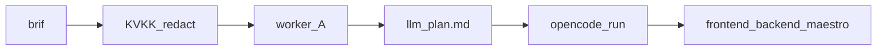

# OpenCode — kod yazma motoru

**Kural:** [.cursor/rules/08-mobile-factory.mdc](../.cursor/rules/08-mobile-factory.mdc) · [integrations.md](integrations.md)

**TR:** OpenCode’u yeniden yazmıyoruz. Cherry CLI’yi **çağırır**. LLM (işçi A) beynidir; OpenCode dosyayı yazar.

**EN:** We do not reimplement OpenCode. Cherry **invokes** the CLI. The LLM (worker A) is the brain; OpenCode writes files.



## Çağrı / Invoke

```bash
opencode run --dir <absoluteProjectRoot> --auto
```

`--dir` must be an **absolute** path. Relative `../../var/projects/...` makes OpenCode fail with `Failed to change directory` because it already started in that folder.

`--dir` mutlak olmalı. Göreli yol `chdir` hatası verir.

Prompt stdin’den, GDPR’den geçmiş brif + plan. Çalışma dizini yalnızca müşteri klasörü. Prompt seçilen yığının dilini ve Clean Architecture katmanlarını zorunlu kılar (Expo SDK 57 TS / Flutter Dart 3.13 / SwiftUI); HTML site yazdırmaz.

The prompt is stdin; already redacted. Working directory is the customer folder only. It requires the selected stack’s current language **and** Clean Architecture — never an HTML website as the app.

**Kişi OpenCode görmez.** Yalnızca Cherry sohbetine yazar. TUI açılmaz. Program `sendProjectMessage` → `opencode run --dir --auto` (sonraki mesajda `--continue`).

**The person never sees OpenCode.** They only write in Cherry. Do not launch the TUI. The program calls `run --auto` in the background.

| Env | Anlam |
| --- | --- |
| `CHERRY_OPENCODE_BIN` | `opencode` yolu (boşsa `vendor/bin` → PATH) |
| `CHERRY_OPENCODE_TIMEOUT_SEC` | tavan (varsayılan 480) |
| `CHERRY_OPENCODE_REQUIRE=1` | CLI yoksa iş başarısız |
| `CHERRY_LLM_API_KEY` | varsa `OPENAI_API_KEY` olarak OpenCode’a geçer |
| `CHERRY_LLM_BASE_URL` | OpenAI uyumlu kök (Colab `https://…/v1` dahil); `OPENAI_BASE_URL` + `opencode.json` custom provider |
| Colab inferans (bağlı) | `setColabInferenceUrl` → OpenCode aynı URL’yi kullanır; anahtar yoksa yer tutucu `cherry-colab`; model varsayılan `Qwen/Qwen2.5-1.5B-Instruct` |

**Colab / OpenAI-compatible:** OpenCode’un built-in `openai` provider’ı `@ai-sdk/openai` ile **`/v1/responses`** çağırır. Colab FastAPI yalnızca **`GET /v1/models`** + **`POST /v1/chat/completions`** sunar → `Not Found: {"detail":"Not Found"}`. Cherry bu yüzden özel provider yazar: `cherry-colab` + `npm: @ai-sdk/openai-compatible` (chat.completions). Model anahtarı slash’sız (`Qwen-Qwen2.5-1.5B-Instruct`); uzak id `models[].id` ile `Qwen/Qwen2.5-1.5B-Instruct`. Base URL `…/v1` olmalı — çift `/v1/v1` yok.

**Colab / OpenAI-compatible:** OpenCode’s built-in `openai` provider calls **`/v1/responses`**. Colab only serves chat.completions → Not Found. Cherry writes provider `cherry-colab` with `@ai-sdk/openai-compatible`. Local model id is slash-free; remote id is set via `models[].id`. Base URL must be `…/v1` (no double `/v1`).

**Kurulum / Install**

Müşteri yalnızca **Cherry** kurar. OpenCode ve Maestro `vendor/bin` (Electron `resources/bin`). PATH yalnızca geliştirici yedeği.

```bash
./scripts/vendor-sidecars.sh
```

CLI yoksa iskelet kalır; **sahte OpenCode yazımı yok**. CLI var, model anahtarı / Colab URL yoksa yazım düşer (açık hata); yine sahte dosya yok. `CHERRY_LLM_API_KEY` → OpenCode `OPENAI_API_KEY`. Bağlı Colab tüneli (`colab-tunnel`) hem LLM Complete hem OpenCode model çağrısı için tercih edilir.

If the CLI is missing the scaffold stays. **No fake OpenCode write.** If the CLI is present but there is no model key (and no Colab inference URL), the run fails honestly.


Geliştirici makinede şimdilik PATH’te `opencode` olabilir. Bu geçici; ürün deneyimi “OpenCode indir” değildir.
