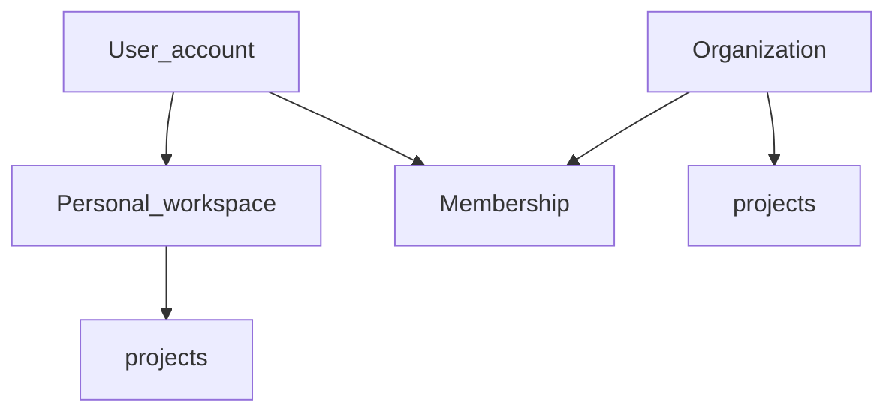

# Organizasyon ve kişisel / Organizations and personal

**Kural:** [.cursor/rules/07-organizations.mdc](../.cursor/rules/07-organizations.mdc)

**TR:** Hesap kişisel çalışma alanı açabilir ve/veya organizasyona üye olabilir.

**EN:** An account can have a personal workspace and/or join organizations.

## Model

## Yetki / Roles

- `owner`: org silme, üye, LLM org ayarı, proje
- `admin`: üye davet, proje, LLM org ayarı
- `member`: kendi işleri, atandığı projeler

Kişisel projeler org’a sızmaz. Org projeleri kişisel diske yanlış tenant ile yazılmaz.

## İki silme / Two deletes

1. Org’dan çıkarma / üye silme — hesap durur.
2. `deleteMe` — platform kullanıcısı ve PII (KVKK). Belge: [gdpr-kvkk.md](gdpr-kvkk.md).
