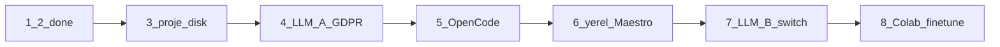

# Duraklama notu / Pause note

**Durum:** Dilim 1–2 bitti. Yeni özellik yazılmıyor. Sıradaki iş **dilim 3**.  
**Status:** Slices 1–2 done. No new features until resume. Next work is **slice 3**.

Repo (private): https://cursor.com/codebase/emrahisik/agent-forge  
Tarayıcı: https://cursor.com/codebase/emrahisik/agent-forge — görünürlük ayarlardan değişir.

Devam dendiğinde: bu dosya + [build-order.md](build-order.md) + ilgili `.cursor/rules` ve `docs/*`.  
On resume: this file + [build-order.md](build-order.md) + the matching rules and docs.

## Bitti / Done

| Dilim | Ne | Not |
| --- | --- | --- |
| 1 İskele | Electron + Next.js (`43147`) + Go GraphQL (`43148`) + shadcn, dark atelier | Login kabuğu, boş projeler |
| 2 Auth + posta | Şifre, yeni cihaz 6 hane, link, TOTP, güvenilir cihaz, tek oturum | SMS yok |
| Mailer | In-app kutu **ve** SMTP veya Resend HTTP | İkisi yoksa `emailSent: false`, kart kod dump etmez |
| Repo | Origin private `emrahisik/agent-forge` | Masaüstüne otomatik kopyalanmaz; yerel clone sen |

Kilit kararlar duruyor: İçerde mobil değil; iki backend karışmaz; müşteriye klasör/zip/git; barındırma yok; AgentMail yok; iki LLM sonra.

Locked decisions still hold: Icerde is not mobile; two backends never mix; customer gets files; no hosting; no AgentMail; two LLMs later.

## Dilim 2 açık uçlar / Slice 2 leftovers (do not block 3)

- Auth store **bellekte**. Mongo ping var; koleksiyon adaptörleri yok. Docker bu cloud VM’de yoktu.
- Gerçek e-posta: kullanıcı `.env` → `SMTP_*` (Gmail uygulama şifresi) **veya** `RESEND_API_KEY`. Production: `ICERDE_MAIL_REQUIRE=1`.
- Electron cihaz parmak izi var; paket/imza (Win/Mac installer) yok.

## Kalan dilimler / Remaining slices

Sıra kilit: **3 → 4 → 5 → 6 → 7 → 8**. Colab ve LLM B öne alınmaz.



### 3 — Proje diski (sıradaki / next)

Brif, yığın seçimi (Expo / Flutter / native — kullanıcı seçer), diskte `frontend/` `backend/` `maestro/`, zip/git el. Ajan henüz **sahte/stub** dosya yazabilir. Belge: [mobile-factory.md](mobile-factory.md).

### 4 — LLM A + GDPR

Tek kod yuvası. Her çağrı: redact → tamamla → denetim. MCP read-file kökü **o proje klasörü**. Admin’de tek aktif versiyon. [llmops.md](llmops.md) · [gdpr-kvkk.md](gdpr-kvkk.md).

### 5 — OpenCode

Stub yazıcı yerine gerçek kod motoru. OpenCode’u yeniden yazma.

### 6 — Yerel aktif + Maestro

Üretilen backend **localhost**. `maestro mcp`, cihaz yoksa skip. Public host yok. [local-activate.md](local-activate.md) · [maestro.md](maestro.md).

### 7 — LLM B + tek tuş switch

Test/inceleme yuvası. Switch **sonraki** cevapları değiştirir, geçmişi değil.

### 8 — Colab fine-tune

Gerçek brif + üretilen kod + test log birikince. En başa alma.

## Çalıştırma / Run (değişmedi)

```bash
npm run dev:api   # 127.0.0.1:43148
npm run dev:web   # 127.0.0.1:43147
```

Yerel kopya: [Origin CLI](https://cursor.com/docs/origin/cli) → `origin repo clone emrahisik/agent-forge`.
