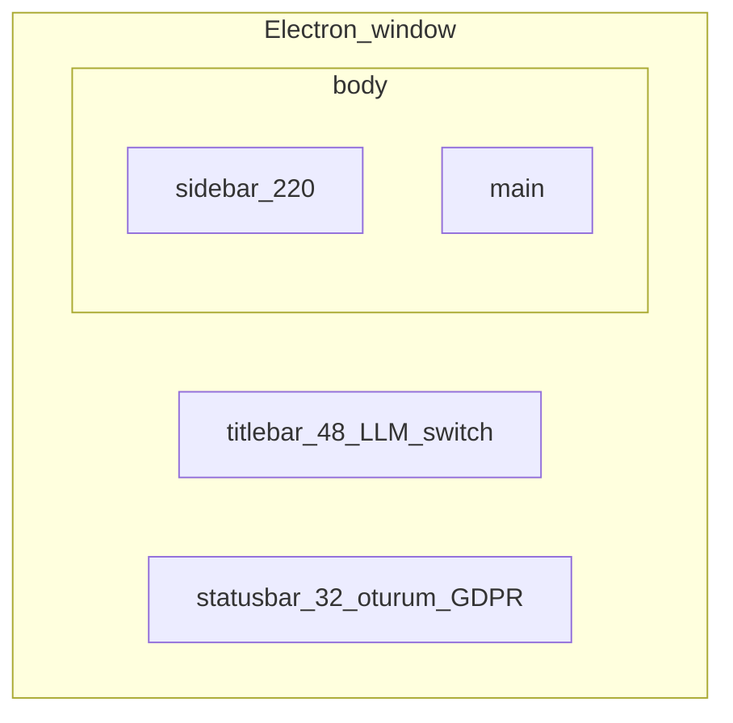
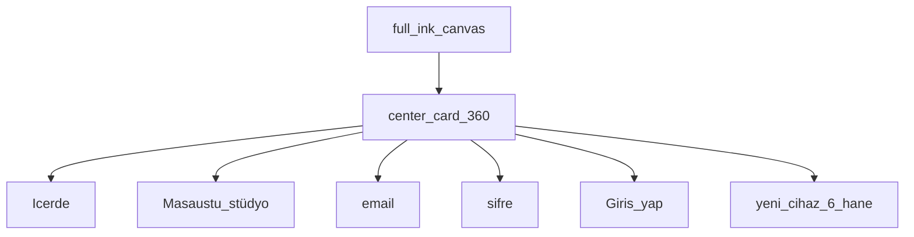
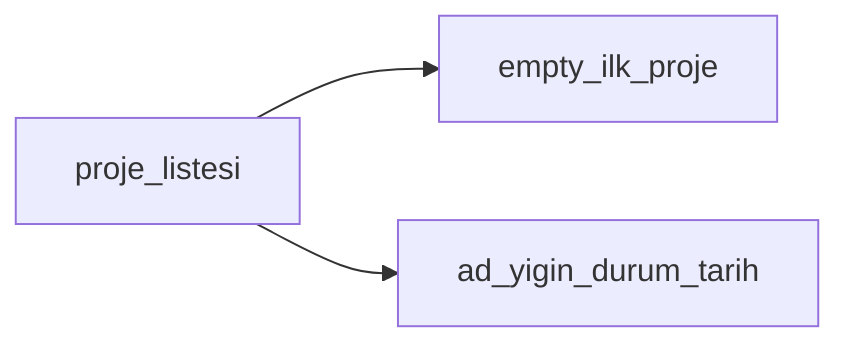
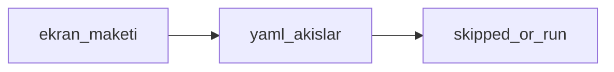

# Ekran tasarımları / Screen designs

**Kural:** [15-design.mdc](../.cursor/rules/15-design.mdc) · [frontend.md](frontend.md)

Her ana ekranın iskeleti. Uygulama bu hiyerarşiyi bozmaz.

Each primary screen has a skeleton. Implementation must keep this hierarchy.

## Kabuk / App shell

- Sidebar 220px, collapse 64px (ikon). Mobil tab bar yok.
- Titlebar: wordmark + proje adı + **LLM A | B** (sağ) — iki kapasite işçisi; meşgul/boş, kod vs test değil.
- Statusbar: oturum, cihaz, GDPR, yerel URL.

## 1. Giriş / Login

Referans: [design/icerde-login.png](design/icerde-login.png)

Boş/hata: kart içinde kırmızı satır, shake yok.

## 2. 6 hane + TOTP

Altı kutu, `font-mono`, 40×48, 8px gap. Yapıştırınca dağılır. TOTP: tek alan + “Authenticator uygulaması”.

## 3. Projeler / Projects

Empty: “Henüz proje yok” + “Yeni proje”. Lorem yok.

## 4. Stüdyo / Studio

Referans: [design/icerde-studio.png](design/icerde-studio.png)

Üç sütun, min 1280px pencerede. Orta: sohbet. Kişi yalnızca buraya yazar; OpenCode TUI yok.

## 5. LLM yönetici

Referans: [design/icerde-llm-admin.png](design/icerde-llm-admin.png)

İki kart A/B: aynı iş, ikinci kart yoğunluk işçisi. Versiyon select, MCP kök, kuyruk/meşgul durumu. Versiyon değişince chip metni anında yeni pointer.

## 6. Güvenlik

Cihaz tablosu + oturum listesi + iptal. X’e benzer sakin liste; kırmızı yalnızca iptal.

## 8. Maestro

Test aşaması veya yan menü. Telefon maketi (üretilen ekranlar) + YAML akış listesi. SKIPPED kırmızı “geçti” değildir.

Üye tablosu; `Verilerimi dışa aktar` / `Hesabı sil` ayrı, tehlikeli aksiyon onay dialog (320ms panel).
