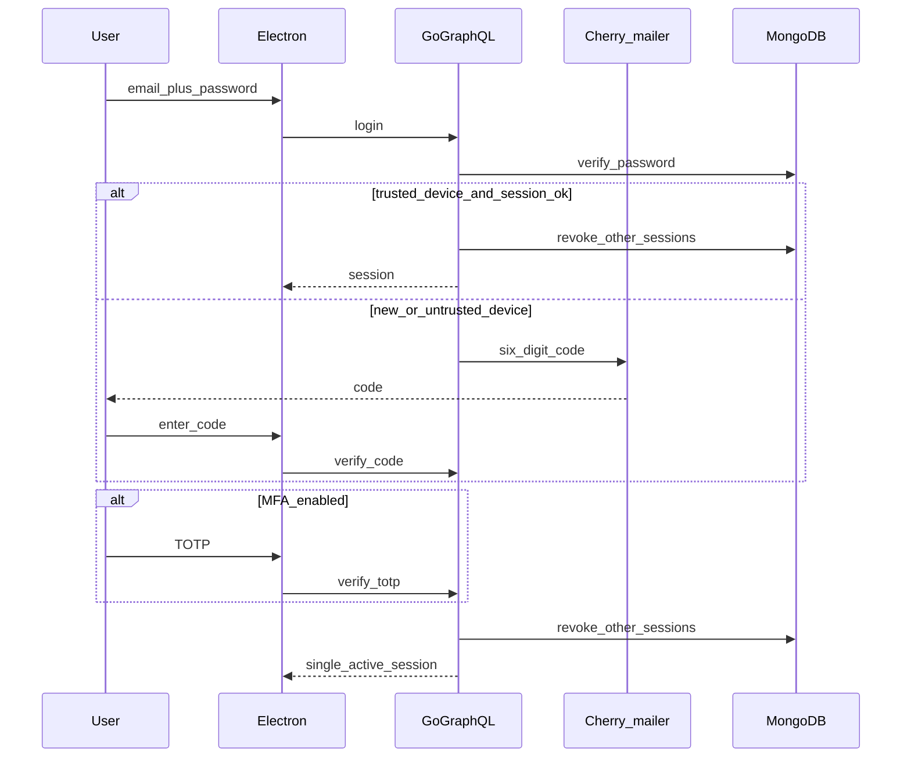
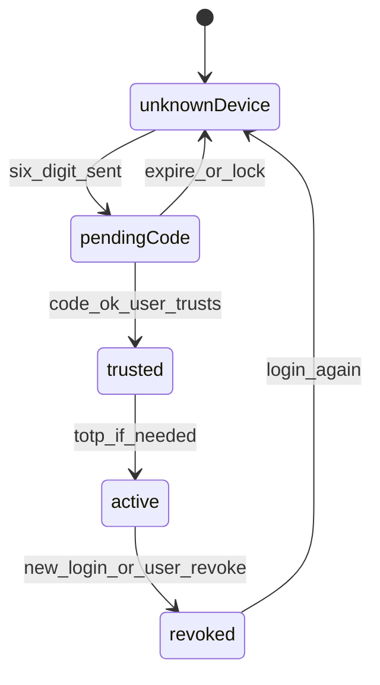

# Güvenlik / Security — X-inspired

**Kural:** [.cursor/rules/06-security.mdc](../.cursor/rules/06-security.mdc) · posta: [email-verification.md](email-verification.md)

**TR:** X’in görünen akışı. SMS yok, telefon kimliği yok, tek oturum. E-posta ve 6 hane **birinci parti**.

**EN:** X’s visible flow. No SMS, no phone identity, one session. Mail and 6-digit codes are **first-party**.

## Giriş sırası / Login order

## Cihaz ve oturum / Device and session

## Alınan / Taken from X

- Password
- 6-digit challenge on new device
- TOTP authenticator
- Trusted devices
- Session list + revoke
- Suspicious login notice

## Alınmayan / Not taken

- SMS, phone number
- Many concurrent sessions (we keep one)
- Blocking temporary-email *providers* as a product feature (we run our own inbox for codes)
- AgentMail or any third-party inbox API
- Passkeys (later)

Codes: ~10 minute TTL, hashed, attempt lock. Details: [email-verification.md](email-verification.md).
